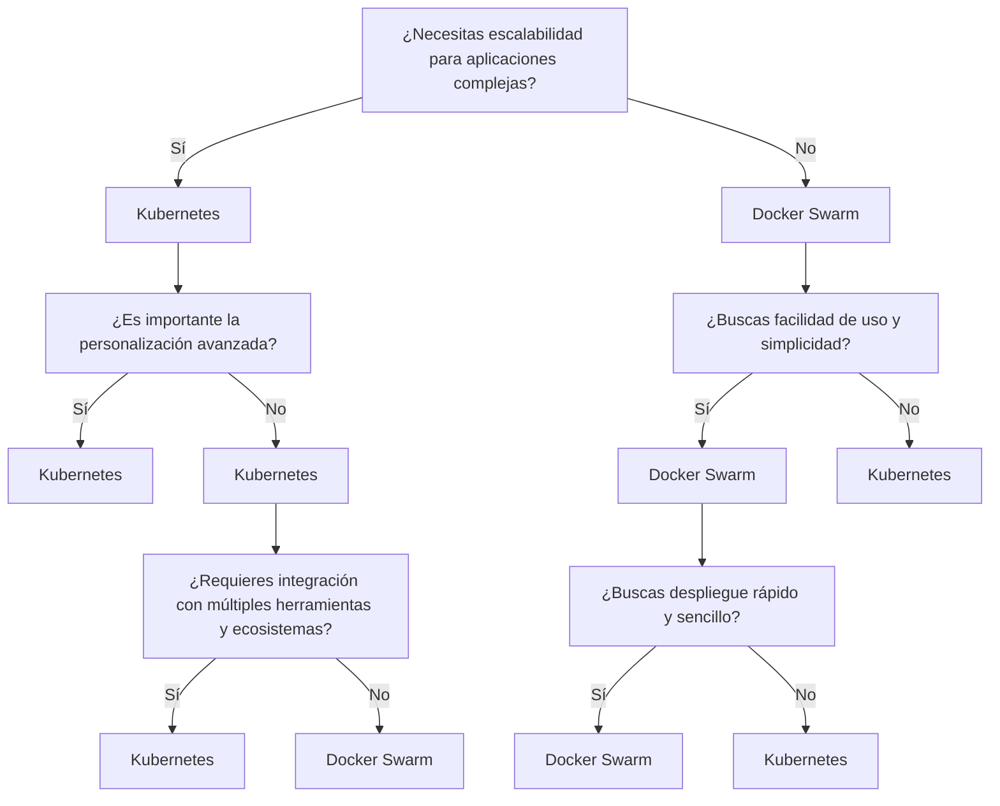
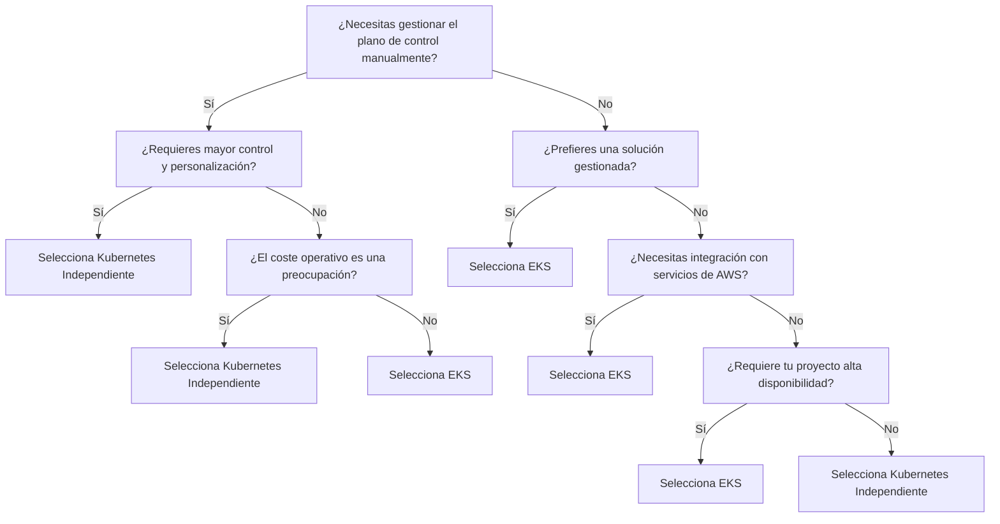
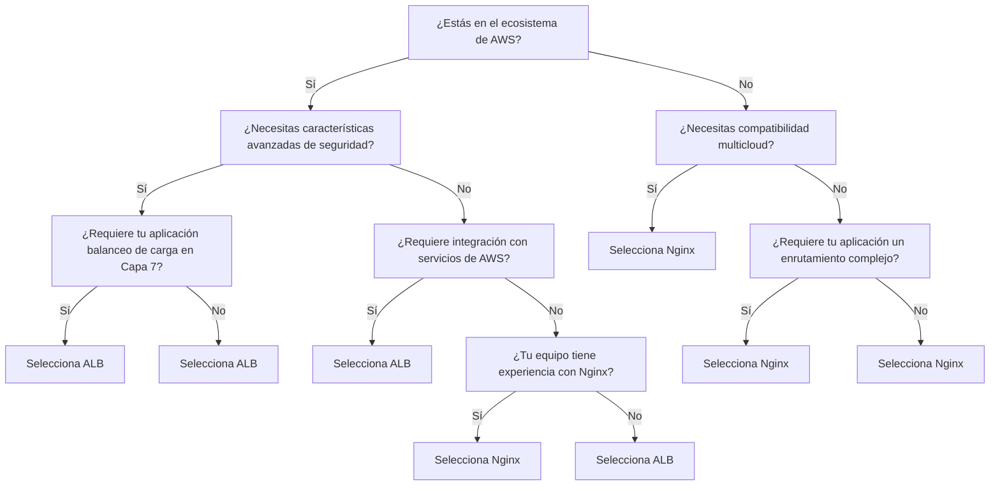

# 0.1. Integrante 1: ANDREA PILAR LLERENA ZÚÑIGA

# Arquitectura de Microservicios en Kubernetes

## Introducción

Este proyecto ilustra una arquitectura basada en microservicios, implementada en un entorno de Kubernetes. Los microservicios son un enfoque arquitectónico que permite desarrollar aplicaciones como un conjunto de servicios pequeños, autónomos y desplegables de manera independiente. Este enfoque mejora la escalabilidad, la mantenibilidad y la agilidad del desarrollo.

## ¿Qué son los Microservicios?

Los **microservicios** son un estilo arquitectónico que descompone una aplicación en componentes pequeños y manejables. Cada microservicio es responsable de una funcionalidad específica y se comunica con otros microservicios a través de API bien definidas. Esto permite a los equipos trabajar de manera independiente en diferentes partes de la aplicación, facilitando el desarrollo, las pruebas y la implementación.

### Ventajas de los Microservicios:

- **Escalabilidad**: Los servicios pueden escalarse de forma independiente según la demanda.
- **Desarrollo ágil**: Los equipos pueden desarrollar y desplegar servicios sin afectar al resto de la aplicación.
- **Resiliencia**: Si un servicio falla, el resto de la aplicación puede seguir funcionando.
- **Flexibilidad tecnológica**: Cada microservicio puede utilizar diferentes tecnologías y lenguajes según las necesidades.
- **Cambios sin afectar otra parte del negocio**
- **Mantenimiento más fácil**
- **Aislamiento de servicios**
  
### Desventajas de los Microservicios:

- **Mayor complejidad**: como los microservicios son distribuidos, gestionar la comunicación sobre los servicios puede resultar difícil. Puede que los desarrolladores tengan que escribir código adicional para garantizar una comunicación fluida entre los módulos.
- **Dificultades de implementación y control de versiones**: coordinar las implementaciones y gestionar el control de versiones en varios servicios puede resultar complejo y provocar incidencias de compatibilidad.
- **Complejidad de las pruebas**: las pruebas de microservicios implican situaciones complejas, sobre todo cuando se realizan pruebas de integración en diferentes servicios. Organizar esta tarea puede ser complicado.
- **Dificultades con la depuración**: puede resultar difícil depurar una aplicación que contiene varios microservicios, cada uno con su propio conjunto de registros. Un único proceso empresarial puede ejecutarse en varias máquinas simultáneamente, lo que agrava la complejidad.
- **Dificultades en la gestión de datos**: la coherencia de los datos y las transacciones entre varios servicios puede resultar compleja. En la arquitectura de microservicios, la gestión y la coordinación de los datos debe hacerse de forma cuidadosa para proteger la integridad de los datos.
- **Dificultad al estandarizar**

## ¿Qué son los Monolitos?

Los **monolitos** son un estilo arquitectónico en el cual una aplicación completa se construye como una única unidad cohesiva. Todas las funciones de la aplicación se ejecutan en un mismo proceso y cualquier cambio requiere desplegar toda la aplicación nuevamente.

### Ventajas de los Microservicios:

- **Menor repitición de código**
- **End to End Test**
- **Deployment rapidos**
- **Facilidad para controlar versiones:** Sólo hay una versión del sistema a la que se le hacen cambios, lo que facilita el control de versiones y el despliegue.
- **Rendimiento consistente:** Como todos los componentes se ejecutan en un mismo proceso, no se requiere comunicación a través de la red, lo que puede mejorar el rendimiento.
  
### Desventajas de los Microservicios:

- **Escalabilidad limitada:** A medida que la aplicación crece, puede volverse difícil escalarla. Escalar un monolito implica replicar toda la aplicación en lugar de escalar solo partes específicas.
Falta de flexibilidad tecnológica: Dado que todos los componentes están juntos, toda la aplicación debe estar desarrollada con las mismas tecnologías, lo que limita la capacidad de utilizar diferentes herramientas o lenguajes para diferentes partes.
- **Despliegue más complicado:** Cualquier cambio, por pequeño que sea, requiere volver a desplegar toda la aplicación, lo que puede aumentar el tiempo de inactividad y el riesgo de errores.
- **Mantenimiento difícil con el crecimiento:** A medida que la aplicación crece en tamaño y complejidad, se vuelve más difícil mantener el código, realizar actualizaciones y corregir errores sin afectar otras partes del sistema.
- **Dependencias fuertes entre componentes:** Los componentes dentro de un monolito tienden a tener dependencias estrechas, lo que dificulta la implementación de nuevas características o cambios sin romper otras partes del sistema.

## ¿Cuando escoger qué?
La elección entre una arquitectura monolítica y una de microservicios depende de varios factores, como la escala del proyecto, la complejidad del sistema y el equipo de desarrollo. Aquí te doy un ejemplo de cuándo elegir cada una y las razones detrás de esa decisión:

### Combinaciones que llevan a monolito

1.- Pequeña Escala + Simplicidad + Equipo Pequeño + No Escalabilidad Independiente + No Resiliencia Alta + Latencia baja preocupación.
(Sistema pequeño, simple, sin necesidad de escalar ni alta resiliencia, con llamadas locales rápidas).

2.- Pequeña Escala + Simplicidad + Equipo Pequeño + No Escalabilidad Independiente + Resiliencia Alta + Latencia baja preocupación.
(Sistema pequeño y simple, pero con alta resiliencia, y latencia interna baja por la comunicación local).

3.- Pequeña Escala + Simplicidad + Equipo Grande + No Escalabilidad Independiente + No Resiliencia Alta + Latencia baja preocupación.
(El equipo es grande, pero el sistema sigue siendo pequeño y simple, con baja latencia debido a la ausencia de comunicación distribuida).

4.- Pequeña Escala + Complejidad Alta + Equipo Pequeño + No Escalabilidad Independiente + No Resiliencia Alta + Latencia baja preocupación.
(Aunque el sistema es complejo, el equipo es pequeño, no requiere escalabilidad ni resiliencia, y mantiene baja latencia local).

**ESCENARIO DE MICROSERVICIOS**

### Combinaciones que llevan a microservicios
1.- Gran Escala + Complejidad Alta + Equipo Grande + Escalabilidad Independiente + Resiliencia Alta 
(Sistema grande y complejo, con equipos grandes, donde es crítico escalar partes del sistema y se requiere alta resiliencia).

2.- Gran Escala + Complejidad Alta + Equipo Grande + Escalabilidad Independiente + No Resiliencia Alta.
(El sistema es grande y complejo, se necesita escalabilidad independiente, pero la resiliencia no es crítica).

3.- Gran Escala + Complejidad Alta + Equipo Pequeño + Escalabilidad Independiente + Resiliencia Alta .
(El equipo es pequeño, pero el sistema es grande y requiere escalabilidad, resiliencia.).

4.- Gran Escala + Complejidad Alta + Equipo Pequeño + Escalabilidad Independiente + No Resiliencia Alta .
(El sistema es grande y requiere escalabilidad independiente, pero la resiliencia.).

5.- Gran Escala + Complejidad Alta + Equipo Grande + Escalabilidad Independiente + Resiliencia Alta
(Sistema grande y complejo, con necesidad de escalabilidad y resiliencia).

## ¿Qué es Kubernetes?

Kubernetes (abreviado como K8s) es una plataforma de código abierto diseñada para automatizar el despliegue, la escalabilidad y la gestión de aplicaciones en contenedores. Los contenedores permiten empaquetar aplicaciones con todas sus dependencias, lo que facilita su portabilidad y ejecución en diferentes entornos. Sin embargo, gestionar múltiples contenedores y garantizar que funcionen correctamente en grandes entornos distribuidos puede ser complejo.

Ahí es donde entra Kubernetes: orquesta estos contenedores de manera que pueda asegurarse de que siempre estén disponibles, correctamente distribuidos en los recursos de hardware, y que se ajusten automáticamente a la demanda. Kubernetes maneja tareas como balanceo de carga, escalado automático, recuperación ante fallos y despliegues continuos, permitiendo a los equipos de desarrollo enfocarse en escribir código sin preocuparse por la infraestructura subyacente.

### Características Clave de Kubernetes:

- **Orquestación**: Gestiona la implementación y la comunicación entre contenedores.
- **Escalabilidad**: Escala automáticamente los microservicios según la carga.
- **Balanceo de Carga**: Distribuye el tráfico entre los diferentes contenedores.
- **Recuperación ante Fallos**: Reinicia automáticamente los contenedores fallidos y reemplaza los nodos defectuosos.

## KUBERNETES VS DOCKER SWAM
Al elegir una plataforma de orquestación, se deben considerar aspectos como escalabilidad, facilidad de uso, complejidad, soporte de la comunidad y capacidades de integración.

### Análisis de Alternativas

1. **Facilidad de Uso**
   - **Kubernetes**: Tiene una curva de aprendizaje más empinada debido a su complejidad, pero permite una personalización detallada y potente.
   - **Docker Swarm**: Es más fácil de aprender y usar, ideal para despliegues rápidos y sencillos.

2. **Escalabilidad**
   - **Kubernetes**: Diseñado para aplicaciones complejas y de gran escala. Es ideal para ambientes en la nube y soporta múltiples nodos y cargas de trabajo de alta disponibilidad.
   - **Docker Swarm**: Aunque es más fácil de configurar, no escala tan eficientemente como Kubernetes en aplicaciones complejas o distribuidas a gran escala.

3. **Comunidad y Soporte**
   - **Kubernetes**: Respaldado por una comunidad vasta y activa, con una gran cantidad de recursos, foros y documentación.
   - **Docker Swarm**: Aunque cuenta con una comunidad activa, es menos popular que Kubernetes, y su adopción ha disminuido en favor de este último.

4. **Flexibilidad y Personalización**
   - **Kubernetes**: Ofrece una mayor flexibilidad con opciones avanzadas de configuración, integraciones, y manejo de redes. Permite adaptar cada aspecto del ciclo de vida de los contenedores.
   - **Docker Swarm**: Tiene menos opciones de personalización, pero eso lo hace más simple y fácil de manejar para casos de uso menos complejos.

5. **Desempeño**
   - **Kubernetes**: Tiende a ser más pesado debido a su complejidad y número de componentes. Sin embargo, está optimizado para entornos a gran escala.
   - **Docker Swarm**: Más rápido y ligero en implementaciones pequeñas o medianas.

6. **Integración y Ecosistema**
   - **Kubernetes**: Se integra fácilmente con proveedores de la nube, herramientas de monitoreo, almacenamiento y seguridad.
   - **Docker Swarm**: Se integra bien dentro del ecosistema Docker, pero ofrece menos soporte para herramientas externas y complementos de terceros.

### Conclusión
- **Kubernetes** es la mejor opción para proyectos grandes y complejos, donde la escalabilidad y la flexibilidad son cruciales. Es la elección para organizaciones que buscan soluciones a largo plazo y alta disponibilidad.
- **Docker Swarm** es ideal para proyectos pequeños o medianos que requieren una implementación rápida y sencilla. Es perfecto para desarrolladores que ya utilizan Docker y necesitan una solución de orquestación sin complicaciones.

### Recomendación
Si el objetivo es soportar aplicaciones a gran escala con alta disponibilidad, Kubernetes es la opción recomendada. Para proyectos que priorizan la simplicidad y un ciclo de desarrollo rápido, Docker Swarm puede ser más adecuado.

### Diagrama de comparaión Kubernetes vs Docker Swarm

## Comparación entre EKS en AWS y Kubernetes Independiente

Kubernetes es una plataforma de código abierto desarrollada por Google para la automatización del despliegue, escalado y operación de contenedores de aplicaciones. Amazon Elastic Kubernetes Service (EKS) es un servicio gestionado por AWS que facilita el uso de Kubernetes en la nube.

### Decisión
Se identifican las siguientes diferencias clave entre EKS y Kubernetes independiente:

1. **Gestión y Operaciones**
   - **Kubernetes Independiente**: Requiere configuración y gestión manual considerable. Todas las tareas, desde la configuración del plano de control hasta la gestión de nodos, deben realizarse manualmente.
   - **EKS**: AWS gestiona el plano de control de Kubernetes, incluyendo actualizaciones, parches y escalabilidad, lo que reduce la carga operativa para los desarrolladores.

2. **Integración con Servicios de AWS**
   - **Kubernetes Independiente**: La integración con servicios de la nube debe hacerse manualmente, lo que puede no ser tan fluido.
   - **EKS**: Se integra naturalmente con servicios de AWS como Elastic Load Balancer (ELB), IAM y CloudWatch, facilitando su uso.

3. **Coste**
   - **Kubernetes Independiente**: Puede resultar menos costoso en términos de infraestructura, pero el coste total debe incluir el tiempo y recursos de gestión.
   - **EKS**: Implica una tarifa de gestión, pero reduce la carga operativa y ofrece integración fluida con servicios de AWS.

4. **Escalabilidad y Disponibilidad**
   - **Kubernetes Independiente**: Puede tener limitaciones en escalabilidad y disponibilidad.
   - **EKS**: Aprovecha la infraestructura de AWS para ofrecer mejor escalabilidad y disponibilidad, permitiendo la creación de múltiples Zonas de Disponibilidad.

### Datos interesantes sobre EKS
- Permite ejecutar un servicio de Kubernetes gestionado sin necesidad de instalar, operar y mantener el plano de control o nodos de Kubernetes.
- EKS ejecuta instancias del plano de control de Kubernetes en múltiples Zonas de Disponibilidad para garantizar alta disponibilidad.
- Detecta automáticamente y reemplaza instancias del plano de control no saludables.
- Proporciona actualizaciones automáticas de versiones y parches para las instancias del plano de control.

### Consecuencias
La elección entre EKS y Kubernetes independiente depende de las necesidades del proyecto y los recursos disponibles:
- **Kubernetes Independiente**: Opción adecuada si se requiere mayor control y personalización o si se desea desplegar en múltiples proveedores de nube o en instalaciones locales.
- **EKS**: Mejor opción si se prefiere una solución menos intensa operativamente con integración fluida en AWS.

### Conclusión
Ambas opciones tienen el propósito de orquestar aplicaciones en contenedores, pero las diferencias en gestión, integración, coste, escalabilidad y disponibilidad deben considerarse para guiar la elección entre EKS y Kubernetes independiente.

# Diagrama de Decisión: EKS vs. Kubernetes Independiente

## Comparativa de Kubernetes Ingress: ALB vs. Nginx
En el entorno de Kubernetes, es esencial gestionar eficientemente el tráfico entrante hacia los servicios. Existen dos soluciones populares para este propósito: Kubernetes Ingress con AWS Application Load Balancer (ALB) y Kubernetes Ingress con Nginx. Cada una ofrece características distintas que pueden adaptarse a diferentes necesidades organizativas.

Elegir entre Kubernetes Ingress con ALB y Nginx se basa en los siguientes criterios:

### 1. AWS Application Load Balancer (ALB) Ingress
- **Propósito e Integración**:
  - ALB se integra de manera estrecha con el ecosistema de AWS, ofreciendo una infraestructura de aplicación cohesiva para clústeres de Kubernetes alojados en AWS.

- **Balanceo de Carga en Capa 7**:
  - Permite enrutar el tráfico basado en criterios avanzados como rutas de URL, nombres de host y encabezados, ideal para escenarios complejos.

- **Características Avanzadas**:
  - Soporta AWS WAF (Web Application Firewall) y terminación SSL/TLS, simplificando el manejo de conexiones seguras.

- **Limitaciones**:
  - Exclusivo para AWS, lo que lo hace menos adecuado para implementaciones multicloud o híbridas.

### 2. Nginx Ingress Controller
- **Versatilidad y Compatibilidad Multinube**:
  - Nginx se puede desplegar en diversos entornos, incluyendo diferentes proveedores de nube y configuraciones on-premises, lo que lo convierte en una opción adecuada para infraestructuras complejas.

- **Flexibilidad de Enrutamiento**:
  - Ofrece opciones de enrutamiento flexibles, incluyendo hosting virtual basado en nombre y reescrituras de URL.

- **Control de Configuración**:
  - Requiere más configuración manual, lo que puede ser una ventaja para usuarios avanzados, pero un desafío para quienes son menos experimentados.

- **Ventajas**:
  - No está vinculado a un proveedor específico de nube, lo que facilita su uso en entornos multicloud e híbridos.

### Consecuencias
- **Si se elige ALB**:
  - Se obtiene una integración fluida con los servicios de AWS y características avanzadas de seguridad, aunque con la limitación de estar atado a la infraestructura de AWS.

- **Si se elige Nginx**:
  - Se permite una mayor flexibilidad y personalización en el enrutamiento, además de la posibilidad de utilizarlo en múltiples nubes, aunque a expensas de una mayor complejidad en la configuración.

### Conclusión
La decisión entre ALB y Nginx debe basarse en los requisitos específicos de la organización. Para aplicaciones en AWS que requieren integración directa con servicios de AWS, ALB es la mejor opción. Sin embargo, para entornos más versátiles que requieren personalización y compatibilidad multicloud, Nginx es preferible.

### Diagrama de Decisión: ALB vs. Nginx Ingress

# Demo - Despliegue de una arquitectura de microservicios con kubernetes en AWS EKS 

La demo se basa en desplegar tres servicios que se comunian entre si usando RabbitMQ (para el cual usamos Amazon MQ en la arquitectura). Asimismo, los tres utilizan una base de datos no relacional, mongoDb para almacenar información. Para su despleigue se utiliza AWS EKS, el cual se muestra mejor en la arquitectura presentada.

## Arquitectura Cloud 

Este diagrama representa una arquitectura en AWS que utiliza Amazon EKS, Amazon MQ, balanceo de carga elástica (ELB), y un VPC conectado mediante peering con MongoDB para los servicios de base de datos. Los componentes clave son:

- **Amazon EKS**: Un servicio de Kubernetes alojado en AWS para gestionar aplicaciones contenedorizadas.
- **Amazon MQ**: Un servicio de mensajería integrado dentro del VPC para manejar la comunicación entre servicios.
- **Elastic Load Balancing (ELB)**: Distribuye el tráfico entrante a través de varios nodos dentro del clúster.
- **Nodos**: Ubicados en subredes privadas distribuidas en dos zonas de disponibilidad para garantizar alta disponibilidad.
- **Peering de VPC**: Conecta el VPC principal con un segundo VPC donde está alojado MongoDB, permitiendo una comunicación segura.

## Arquitectura de Servicios Kubernetes

Este diagrama muestra una arquitectura típica de servicios en Kubernetes utilizando un balanceador de carga para gestionar el tráfico entrante hacia diferentes microservicios. Los elementos clave incluyen:

- **Load Balancer HTTPS**: Dirige el tráfico externo hacia el clúster. --> Usamos el AWS ALB
- **Ingress (ing)**: Administra el acceso a los servicios, recibiendo tráfico desde el balanceador de carga y enrutándolo internamente.  --> Usamos el AWS ALB Ingress
- **Servicios (svc)**: Conectan el tráfico a los pods específicos que ejecutan diferentes servicios.
- **Pods**: Ejecutando distintos microservicios como `orders`, `billing` y `auth`, todos dentro del mismo namespace.

Esta configuración resalta el uso de un balanceador de carga, un ingress y servicios para escalar los microservicios de manera eficiente dentro de un clúster de Kubernetes.

## Herramienta utlizada para el desliegue: HELM

**Helm** es una herramienta de gestión de paquetes para Kubernetes, que simplifica la instalación, actualización y gestión de aplicaciones dentro de un clúster.

### Conceptos Clave

- **Charts**: Conjuntos de archivos YAML que definen los recursos necesarios para ejecutar una aplicación en Kubernetes.
    Un chart puede incluir archivos como:
  
    - **Deployment**: Define cómo se ejecutarán los contenedores de la aplicación.
    - **Services**: Configura cómo se exponen los contenedores.
    - **ConfigMaps/Secrets**: Almacenan configuraciones sensibles o no sensibles.
    - **Ingress**: Define cómo el tráfico externo accede a la aplicación
    - **Release**: Una instancia instalada de un chart en Kubernetes. Cada actualización genera una nueva release.
    - **Plantillas**: Permiten parametrizar configuraciones mediante variables, facilitando la personalización del despliegue.

### Beneficios

- **Simplicidad**: Instalación de aplicaciones con un solo comando.
- **Consistencia**: Despliegue coherente en entornos de desarrollo, pruebas y producción.
- **Reusabilidad**: Uso de charts compartidos y reutilizables.
- **Gestión de Versiones**: Facilita actualizaciones y retrocesos (rollback) de aplicaciones.

## PASO A PASO 

1.- Crear workspace para crear nuestro microservicios en Nest.js

2.- Vamos creando nuestra app order, billing y auth con el mismo comando 

3.- Creamos nuestra libreria en comun con
**nest g library commo**

4.- Instalamos mongoose para manejo de mongoDb, y las demás dependencias necesarias para crear configuraciones necesarias como JWT, RabbitMQ

5.- Luego de establecer una comunicacion entre los microservicios que escuchan a RabbitMQ creamos las imagenes de nustros servicios

6.- Se sube nuestras imaganes a Docker Hub para usarlas despues 

7.- Ahora creamos los recursos en la nube, RabbitMQ y MongoDB

8.- Creamos un cluster y una bd en MongoDb Atlas

9.- Creamos una carpeta helm en nuestro workspace e instalamos helm, para ello seguir la siguiente documentación
  - https://helm.sh/docs/intro/install/

10.- Luego ejecutamos el comando helm install ordering-app

11.- Configurar los deployment, service  e ingress

12.- Instalar AWS CLI y Eksctl
- https://docs.aws.amazon.com/eks/latest/userguide/what-is-eks.html
- https://docs.aws.amazon.com/cli/latest/userguide/cli-chap-configure.html

13.- AL tener ambos configurados con eksctl se crea el cluster : eksctl create cluster ordering-app

14.- Se configura el ALB para que mas adelante use nuestro ingress , para ello se sigue la siguiente doumentación

- https://kubernetes-sigs.github.io/aws-load-balancer-controller/v2.4/

15.- Finalmente se despliega nuestro aplicativo usando helm install ordering-app

16.- Luego de ello tendremos nuestro app  y cada microservicio orriendo en eks

**DEMO VIDEO:** https://streamyard.com/r79dgvp86fgg

**REPOSITORIO:** https://github.com/AndreaLlerena2003/demo-ArquiDeSoftware-LlerenaAndrea

# Patrón Cloud - Saga

## Desarrollo del Patrón:

- **Problema**: En un sistema distribuido, realizar una transacción que involucra múltiples servicios puede ser riesgoso, ya que cualquier falla en uno de los servicios puede dejar la transacción en un estado inconsistente. Un sistema necesita garantizar que, incluso si ocurre un error, pueda deshacer las acciones previas o completar la transacción de forma consistente.

- **Solución**: El **patrón Saga** divide una transacción en una serie de pasos independientes, donde cada paso tiene una acción compensatoria asociada. Si algún paso falla, las acciones previas se revierten mediante estas acciones compensatorias, lo que asegura que el sistema vuelva a un estado consistente.
  
## Conceptos Fundamentales:
- **Transacciones Distribuidas:** En un sistema distribuido, las operaciones pueden involucrar múltiples microservicios que pueden tener sus propias bases de datos. Esto dificulta la implementación de transacciones atómicas.
- **Compensación:** Cuando una operación dentro de una saga falla, es necesario revertir (o compensar) las operaciones que ya se han completado. Esto se logra mediante operaciones compensatorias que deshacen los efectos de las operaciones previas.
- **Orquestación vs. Coreografía:**
    - **Orquestación:** Un componente central (el orquestador) dirige el flujo de la saga, enviando mensajes a los participantes y coordinando las acciones.
    - **Coreografía:** Cada servicio participante se comunica entre sí a través de eventos, sin un controlador central. Cada servicio conoce su parte de la saga y responde a eventos de otros servicios.

| **Aspecto**                | **Orquestación**                                                | **Coreografía**                                                |
|----------------------------|---------------------------------------------------------------|--------------------------------------------------------------|
| **Definición**             | Un componente central (orquestador) dirige el flujo de la saga. | Los servicios participantes se comunican entre sí mediante eventos. |
| **Control**                | Control centralizado, donde el orquestador toma decisiones.   | Control distribuido, cada servicio gestiona su propia lógica. |
| **Complejidad**            | Puede ser más simple de entender debido a la centralización.  | Puede volverse complejo a medida que aumenta el número de servicios. |
| **Escalabilidad**          | Escalable, pero puede convertirse en un punto único de fallo. | Escalable y resiliente, sin un punto único de fallo.        |
| **Manejo de Errores**      | El orquestador puede implementar estrategias de manejo de errores de manera centralizada. | Requiere que cada servicio implemente su propio manejo de errores. |
| **Visibilidad**            | Mayor visibilidad del flujo de trabajo y estado general.       | Puede ser difícil de rastrear y depurar debido a la falta de control central. |
| **Desarrollo**             | Permite un desarrollo más lineal y controlado.                | Favorece la autonomía de los equipos, permitiendo iteraciones independientes. |
| **Flexibilidad**           | Menos flexible, ya que cualquier cambio en el flujo requiere modificaciones en el orquestador. | Más flexible, permite que los servicios se adapten sin afectar a otros. |
| **Implementación**         | Puede requerir herramientas y tecnologías adicionales para el orquestador. | Requiere un diseño sólido de eventos y una infraestructura que soporte la comunicación entre servicios. |
| **Ejemplos de Uso**        | Ideal para flujos de trabajo complejos con pasos claramente definidos. | Adecuado para sistemas altamente distribuidos y dinámicos donde la autonomía de los servicios es clave. |

## Estructura del Saga:
- **Pasos de la Saga:** Una saga consta de una secuencia de pasos donde cada paso representa una operación realizada por un microservicio. Cada operación debe ser capaz de ejecutarse independientemente y tener una operación compensatoria.
- **Gestor de Sagas:** Un gestor (o coordinador) es responsable de gestionar el estado de la saga, asegurándose de que todas las operaciones se realicen correctamente y, en caso de fallo, se ejecuten las operaciones compensatorias.

## Comparativa de Saga Manual vs Saga con Servicios Cloud

| **Aspecto**                | **Saga Manual**                                                 | **Azure Durable Functions**                                   |
|----------------------------|----------------------------------------------------------------|--------------------------------------------------------------|
| **Implementación**         | Requiere diseño y codificación manual del flujo de trabajo.   | Proporciona una manera estructurada de definir flujos de trabajo con menos esfuerzo manual. |
| **Gestión del Estado**     | Necesita mantener el estado de la saga manualmente (por ejemplo, en base de datos). | Maneja automáticamente el estado de las funciones, permitiendo que se suspendan y reanuden sin perder datos. |
| **Escalabilidad**          | Puede ser difícil de escalar, ya que depende del diseño de la aplicación y la infraestructura. | Altamente escalable, diseñado para manejar cargas variables sin necesidad de cambios significativos en el código. |
| **Manejo de Errores**      | Se requiere lógica de manejo de errores y compensación manual. | Integración de manejo de errores y compensación a través de patrones predefinidos. |
| **Despliegue**             | Necesita gestionar la infraestructura y el despliegue manualmente. | Despliegue más sencillo a través del portal de Azure y la CLI, con integración continua posible. |
| **Costos**                 | Costos fijos asociados a la infraestructura y mantenimiento.   | Modelo de pago por uso, basado en la ejecución de funciones, que puede ser más económico en función de la carga. |
| **Flexibilidad**           | Permite total personalización de la lógica de la saga.        | Limitado por la estructura de Durable Functions, aunque ofrece suficiente flexibilidad para la mayoría de los casos de uso. |
| **Interoperabilidad**      | Necesita implementar integraciones con otros servicios manualmente. | Soporta integración fácil con otros servicios de Azure y APIs externas. |
| **Desarrollo y Mantenimiento** | Mayor carga en el equipo de desarrollo para crear y mantener el flujo de trabajo. | Facilita el desarrollo y el mantenimiento con herramientas y plantillas de Azure. |
| **Complejidad del Código** | Puede resultar en un código más complejo y difícil de seguir a medida que crece el número de pasos. | Estructura más clara y fácil de seguir debido a la naturaleza de las funciones y los orquestadores. |
| **Pruebas y Debugging**    | Las pruebas pueden ser complicadas debido a la naturaleza del flujo de trabajo. | Mejores capacidades de prueba y depuración gracias a la naturaleza modular de las funciones. |

## Casos de Aplicación:

1. **Procesos de reserva de vuelos y hoteles**:
   - Al reservar un paquete de viaje que incluye vuelo y hotel, el sistema debe garantizar que si la reserva del vuelo falla, la reserva del hotel también se deshaga. El patrón Saga asegura que ambas operaciones se realicen exitosamente o se reviertan en caso de error.

2. **Pedidos en e-commerce**:
   - En sistemas de comercio electrónico, al procesar una orden que implica verificar el inventario, cobrar al cliente y enviar el pedido, si alguno de los pasos falla (por ejemplo, el inventario no está disponible), las acciones previas deben revertirse, como cancelar el cargo al cliente.

3. **Transferencias bancarias**:
   - Las transferencias bancarias entre cuentas en diferentes bancos pueden usar Saga. Si la transferencia en uno de los bancos falla, el sistema puede compensar la operación deshaciendo la transacción en el banco que ya realizó el cargo.

## Aplicación en Trabajo de Grupo:

- **Problema**: Se está desarrollando un sistema de reservas y compras en línea que involucra la reserva de múltiples recursos, como productos, inventario, y el procesamiento de pagos. Si algún paso falla, el sistema debe poder compensar las acciones anteriores.
  
- **Solución**: Implementar el patrón Saga para asegurar que, si una reserva de inventario o el procesamiento del pago falla, se deshagan las acciones previas (como la reserva del producto en el sistema o el cargo a la tarjeta de crédito). Esto garantizará que el sistema mantenga la consistencia y que no se afecte negativamente la experiencia del cliente.

  
## Desarrollo de Código y Demo:

En las imagenes se muestra el flujo implementado, se busca hacer la gestion de reservas en un SPA (para le demo solo se trabaja con un solo salon de belleza), se usan tres microservicios, availability-service, payment-service y reservation-service. Los tres tienen su propia base de datos en mongo definida en el archivo de docker-compose.yaml de la demo. El patron SAGA implementado es del tipo **Orquestación**, ya que el servicio reservation-service, es el componente central que dirije la saga. 

### Clases y Componentes

#### `CreateAppointmentSaga`

- **Responsabilidad**: Controlar la ejecución de una serie de pasos para la creación de citas, manejar errores y realizar rollbacks si es necesario.

#### Propiedades

- `steps`: Un array que contiene los pasos a ejecutar en la saga.
- `successfulSteps`: Un array que mantiene un registro de los pasos que se han completado con éxito.

#### Constructor

- **Parámetros**:
  - `placeAppointmentStep`: Paso para colocar la cita.
  - `checkAvailabilityStep`: Paso para verificar la disponibilidad.
  - `authorizePaymentStep`: Paso para autorizar el pago.
  - `confirmAppointmentStep`: Paso para confirmar la cita.
  - `updateAvailabilityStep`: Paso para actualizar la disponibilidad.

#### Métodos

- `execute`: Ejecuta cada paso de la saga. Si un paso falla, realiza el rollback de todos los pasos exitosos hasta el momento.
  - **Parámetros**:
    - `appointment`: La cita que se está creando.

- `rollbackSuccessfulSteps`: Revierte los pasos que se completaron con éxito en caso de que ocurra un error en un paso posterior.
  - **Parámetros**:
    - `appointment`: La cita que se está procesando.

#### Estructura de los STEPS
La clase `Step` es una clase abstracta que define la estructura básica para cada paso en la saga. La cual es extendida por los steps específicos mencionados. Estas son sus propiedades: 

  - `name`: Una cadena que representa el nombre del paso. Este nombre se utiliza para registrar información en los logs y facilitar la identificación de cada paso durante la ejecución de la saga.
  - `invoke(params: T): Promise<R>`: Método abstracto que es implementado por las clases derivadas. Este método se encarga de ejecutar la lógica del paso y devolver un resultado encapsulado en una promesa.
  - `withCompenstation(params: T): Promise<R>`: Método abstracto que es implementado por las clases derivadas. Este método se utiliza para realizar la compensación en caso de que el paso anterior falle o deba ser repetido. Es esencial para manejar errores y garantizar que el estado del sistema se mantenga consistente

Un dato importante es que por cada invoke, hay un evento en el respectivo servicio, por ejemplo, para el servicio payment, se tiene el evento 'payment.payment.authorize' , que se envia mediante el invoke, pero si sucede un tipo de error, se envia el evento 'payment.payment.refund', mediante el método withCompenstation.

## Flujo de Ejecución

1. Se invoca el método `execute` con un objeto `Appointment`.
2. Se recorren los pasos en el orden definido en el constructor.
3. Cada paso se ejecuta y, si se completa correctamente, se añade a la lista de pasos exitosos.
4. Si un paso falla, se llama al método de rollback, que revertirá todos los pasos exitosos.
5. Se imprime un mensaje indicando si la creación de la cita fue exitosa o si hubo un error.

## Prueba

1. Al ejecutar el post resepectivo para realizar una reserva podemos ver como se ejecuta los siguientes pasos
   
2. Luego de ejeutarlo vemos como en el reservation service se ejecuta los pasos del patrón saga
   
3. Y vemos como se llama los respectivos eventos a sus respectivos microservicios
   
   

5. Asimimismo en la UI de Kafka podemos ver los eventos enviados con su respectivo reply
   
   
   
   
   
   

6. Finalmente vemos los resultados finales en la base de datos

    6.1. Resultado en BD Appointment -  Appointment collection
   
    6.2. Resultado en BD Payment -  Payment collection
   
    6.3. Resultado en BD Availability - Availability collection
   

## Link de Github
- https://github.com/AndreaLlerena2003/DEMO-SAGA-PATTERN-ANDREA_LLERENA

## Link de Apoyo
- https://learn.microsoft.com/en-us/azure/architecture/reference-architectures/saga/saga
- https://www.youtube.com/watch?v=AqMViipU284&ab_channel=Devoxx
   

# MLOps con MlFlow

## Introducción
MLOps (Machine Learning Operations) es un conjunto de prácticas y herramientas que unifican el desarrollo de modelos de aprendizaje automático (machine learning) y su implementación en producción. Su propósito es facilitar la colaboración entre equipos de Data Science, desarrollo de software y operaciones, optimizando la entrega continua y la supervisión de modelos de machine learning a gran escala. MLOps se puede considerar una extensión de las prácticas de DevOps aplicadas al ámbito de la inteligencia artificial.

## Marco Teórico de MLOps

MLOps emerge como una respuesta a los desafíos de integrar y mantener modelos de machine learning en entornos productivos. Aunque el desarrollo de modelos de machine learning sigue el ciclo de vida clásico de cualquier software, tiene características propias debido a la naturaleza dinámica de los datos, la complejidad de los modelos y la necesidad de actualización constante.

### Componentes de MLOps

- **Automatización y pipeline de datos:** MLOps promueve la automatización de los flujos de trabajo, desde la recopilación de datos hasta la implementación de modelos. Esto incluye la creación de pipelines de datos que automatizan la limpieza, transformación y carga de datos para ser utilizados en el entrenamiento de modelos.

- **Gestión de modelos:** A medida que se entrenan múltiples modelos y versiones, MLOps se encarga de versionar, almacenar y gestionar estos modelos para asegurar que siempre se utilice la versión adecuada en producción.

- **Monitoreo y trazabilidad:** El monitoreo de los modelos es esencial para detectar desviaciones en su rendimiento o en los datos, lo que permite realizar ajustes o reentrenamientos. Las herramientas de trazabilidad aseguran que se pueda reproducir cualquier experimento o despliegue, lo cual es crucial para la auditoría y el cumplimiento normativo.

- **Colaboración entre equipos:** MLOps facilita la colaboración entre los equipos de Data Science, ingenieros de datos, desarrolladores de software y operaciones de TI. Esto se logra mediante la integración de herramientas y prácticas que permiten una comunicación fluida y la automatización de tareas repetitivas.

### Ciclo de Vida de MLOps

1. **Adquisición de datos:** Los datos son la base del modelo. En esta etapa, se recopilan, almacenan y procesan datos para que puedan ser utilizados en el entrenamiento.
   
2. **Preprocesamiento y limpieza de datos:** Los datos crudos suelen estar desordenados, incompletos o mal formateados. El preprocesamiento y la limpieza de datos incluyen la normalización, la transformación de valores, el tratamiento de valores nulos, y la selección de características relevantes.

3. **Entrenamiento y validación de modelos:** En esta fase, se utilizan técnicas de machine learning para crear un modelo predictivo. El proceso incluye la selección de algoritmos, la validación cruzada y la optimización de hiperparámetros.

4. **Despliegue y monitorización:** Una vez entrenado el modelo, es desplegado en un entorno de producción. En producción, el modelo hace inferencias sobre nuevos datos. Es importante monitorear el modelo continuamente para asegurar su rendimiento. Los indicadores clave incluyen el *drift* de datos, el *drift* del modelo y el rendimiento en tiempo real.

5. **Mantenimiento y actualización:** Los modelos pueden volverse obsoletos con el tiempo debido a cambios en los datos o el entorno. Los modelos deben actualizarse o reentrenarse periódicamente para mantener su relevancia y precisión.

### Herramientas y Tecnologías en MLOps

- **Automatización de pipelines:** Herramientas como **Kubeflow**, **Airflow**, **MLFlow** o **TensorFlow Extended (TFX)** son utilizadas para automatizar los pipelines de datos y modelos, desde la ingestión de datos hasta la implementación.
  
- **Control de versiones de modelos y datos:** Herramientas como **DVC (Data Version Control)** o **MLFlow** permiten versionar tanto los datos como los modelos, asegurando que se pueda rastrear y reproducir cualquier experimento.

- **Infraestructura como código (IaC):** Para gestionar la infraestructura en la que se ejecutan los modelos, MLOps hace uso de herramientas como **Terraform** y **Kubernetes**, lo que facilita la creación de entornos de producción escalables y reproducibles.

- **Contenerización y orquestación:** El uso de **Docker** para contenerizar aplicaciones y **Kubernetes** para su orquestación son esenciales para la escalabilidad de los modelos en producción.

- **Monitoreo de modelos:** Herramientas como **Prometheus**, **Grafana**, **ELK stack** y **Seldon** permiten monitorear el rendimiento del modelo en producción, detectando cualquier anomalía o desviación en su rendimiento.

###  Desafíos de MLOps

- **Escalabilidad:** A medida que los modelos crecen en complejidad, la infraestructura y los pipelines deben ser capaces de escalar sin comprometer el rendimiento. Esto puede ser un reto, especialmente cuando se procesan grandes volúmenes de datos o se realizan inferencias en tiempo real.

- **Gestión del ciclo de vida del modelo:** Los modelos de machine learning no son estáticos y pueden necesitar reentrenamiento frecuente, lo que puede llevar a la complejidad en la gestión de diferentes versiones de modelos, su implementación y seguimiento.

- **Desviación de datos (Data Drift):** Los modelos pueden volverse obsoletos si los datos en producción cambian. Detectar y adaptarse a estos cambios en los datos es un desafío clave de MLOps.

- **Colaboración interequipos:** MLOps implica la interacción entre varios equipos, como los de Data Science, desarrollo de software e infraestructuras. La falta de comunicación o la integración de herramientas puede causar cuellos de botella en los procesos.

###  Impacto de MLOps en las Empresas
La adopción de MLOps permite a las empresas mejorar la eficiencia en el desarrollo y la implementación de modelos de machine learning. La automatización de procesos reduce el tiempo de desarrollo y permite iteraciones más rápidas, lo que se traduce en modelos más precisos y eficaces. Además, la integración continua de modelos con procesos de despliegue y monitorización constante contribuye a un ciclo de vida más ágil y adaptable a cambios.

## ADRs: Comparación de Herramientas de MLOps - MLflow vs. Amazon SageMaker vs. Azure Machine Learning vs. Google AI Platform

### Contexto

Las herramientas de MLOps deben ofrecer capacidades de experimentación, despliegue, monitorización y gestión de modelos en producción. Evaluamos aquí las herramientas **MLflow**, **Amazon SageMaker**, **Azure Machine Learning**, y **Google AI Platform** para ayudar en la selección de la herramienta que mejor se ajuste a un entorno de producción.

---

### Decisión

Comparar las herramientas MLOps y destacar las fortalezas de cada una en función de distintos criterios clave: funcionalidad, flexibilidad, facilidad de uso, integración, costo, y escalabilidad.

| Criterio                       | MLflow                          | Amazon SageMaker                | Azure Machine Learning          | Google AI Platform              |
|--------------------------------|---------------------------------|---------------------------------|---------------------------------|---------------------------------|
| **Propósito**                  | Gestión de experimentos, implementación, model tracking | Plataforma integral de ML gestionada por AWS | Plataforma completa de MLOps y DevOps en la nube | Solución gestionada para entrenar, servir y monitorizar modelos en la nube de Google |
| **Gestión de Experimentos**    | ✔️ Fácil, con versiones de experimentos y modelos | ✔️ Completo, con versiones automáticas y tracking detallado | ✔️ Flexible, con dashboards personalizables | ✔️ Compatible con TensorBoard, fácil integración con Google Colab |
| **Gestión de Modelos**         | ✔️ Sencilla, con seguimiento de artefactos y métricas | ✔️ Completa, gestión automatizada de versiones | ✔️ Soporte para múltiples modelos y versiones | ✔️ Integrado con AI Hub y autoML para modelo-as-a-service |
| **Entrenamiento Escalable**    | 🚫 Limitado a frameworks propios o integración personalizada | ✔️ Servicios de entrenamiento distribuidos en AWS | ✔️ Jobs escalables, compatible con Kubernetes | ✔️ Escalable con Google Kubernetes Engine (GKE) |
| **Despliegue de Modelos**      | ✔️ Dockerizado o en entornos de prueba | ✔️ Completamente gestionado en AWS Lambda o endpoints | ✔️ Servicios gestionados y escalables con ACI o AKS | ✔️ Despliegue gestionado en GCP con autoescalado |
| **Integración con Ecosistema** | ✅ Compatible con cualquier nube, frameworks open-source | 🔄 Integrado profundamente con AWS, IAM, S3 | 🔄 Optimizado para ecosistema de Azure, DevOps y SQL | 🔄 Integración con servicios de GCP (BigQuery, Dataflow) |
| **Facilidad de Uso**           | 👍 Sencillo para pequeñas implementaciones | 👍 Intuitivo para usuarios de AWS, múltiples opciones GUI | 👍 Interfaz amigable y guías detalladas en Azure Portal | 👍 Familiar para usuarios de GCP, gran compatibilidad con Google Colab |
| **Costo**                      | 💵 Bajo, gratuito y open-source; costos solo de infraestructura | 💰 Costo en función del uso de servicios AWS | 💰 Pago por uso de recursos en Azure | 💰 Escalable con pago por uso en Google Cloud Platform |
| **Escalabilidad**              | 🚫 Limitada; depende de integración personalizada | ✔️ Alto, optimizado para servicios AWS | ✔️ Alto, optimizado para entornos de Azure y Kubernetes | ✔️ Alto, escalable automáticamente con GKE |

## Pros y Contras

#### MLflow

- **Pros:** 
  - Open-source, altamente personalizable.
  - Ideal para proyectos donde la flexibilidad es esencial y se prefiere una solución agnóstica de nube.
  - Soporta múltiples frameworks de machine learning y tiene una comunidad activa.

- **Contras:** 
  - No incluye infraestructura en la nube; requiere configuración adicional para escalabilidad.
  - Requiere personalización para despliegue y mantenimiento de modelos en producción.

#### Amazon SageMaker
- **Pros:** 
  - Solución integral gestionada con integración profunda en AWS.
  - Ofrece despliegue de modelos a gran escala, almacenamiento de artefactos, experimentación y monitorización.
  - Funciones avanzadas como entrenamiento distribuido, AutoML y despliegue a endpoints.

- **Contras:** 
  - Puede resultar costoso a medida que los proyectos escalan.
  - Depende completamente del ecosistema de AWS, lo que limita la flexibilidad.

#### Azure Machine Learning
- **Pros:** 
  - Integración profunda con Azure DevOps y otros servicios de Microsoft.
  - Gran soporte para entrenamientos distribuidos, Kubernetes y CI/CD.
  - Ofrece herramientas de visualización para monitorización de experimentos y modelos.

- **Contras:** 
  - Costoso para grandes implementaciones, especialmente si se requiere entrenamiento intensivo en recursos.
  - Limitado a usuarios y organizaciones dentro del ecosistema de Microsoft Azure.

#### Google AI Platform
- **Pros:** 
  - Integración nativa con GCP, BigQuery, y Dataflow para flujos de trabajo de datos.
  - Compatible con Google Kubernetes Engine para despliegues escalables.
  - Facilita experimentación y despliegue con servicios gestionados y AutoML.

- **Contras:** 
  - La flexibilidad de personalización es limitada fuera de GCP.
  - Costos pueden aumentar rápidamente con el uso de infraestructuras avanzadas como TPU.

### Recomendación

1. **MLflow** es ideal para proyectos de machine learning donde se requiere flexibilidad, personalización y una solución open-source independiente de la nube.
2. **Amazon SageMaker** es adecuado para empresas ya integradas en AWS que buscan una solución completa y gestionada con escalabilidad en la nube.
3. **Azure Machine Learning** es la mejor opción para usuarios de Microsoft Azure que requieren un entorno de CI/CD y una gestión integral de experimentos y modelos.
4. **Google AI Platform** es una excelente elección para proyectos intensivos en datos y usuarios de GCP que buscan aprovechar el ecosistema Google para análisis y escalabilidad.

Cada opción permite una personalización adecuada, aunque la dependencia de un ecosistema en la nube específico puede ser una consideración crítica para proyectos a largo plazo.

## Demo con la Herramienta MLFlow

- https://github.com/AndreaLlerena2003/mlOps-mlFlow

## Video de Demostración
- https://streamyard.com/zxwudefhzyxh

  
# Documentación: Demo de MLflow con Clasificación de Imágenes

Esta demo utiliza **MLflow** para rastrear experimentos de Machine Learning con un modelo de clasificación de imágenes basado en TensorFlow y MobileNet. El flujo incluye la descarga de imágenes, preprocesamiento, entrenamiento y registro del modelo.

## Objetivos
1. Utilizar MLflow para gestionar el seguimiento de experimentos.
2. Entrenar un modelo con TensorFlow (MobileNet) para clasificar entre dos clases de imágenes.
3. Automatizar la descarga de datos y preprocesamiento con herramientas como `bing_image_downloader`.

## Requisitos

- `mlflow`
- `tensorflow`
- `bing_image_downloader`
- `matplotlib`
- `requests`

## Paso 1: Importación de Librerías

En esta etapa, importamos las librerías necesarias para el proyecto, incluyendo TensorFlow, Keras, MLflow y otras herramientas útiles como `matplotlib` para la visualización y `bing_image_downloader` para descargar imágenes.

## Paso 2: Descarga Automática de Imágenes

Usamos la librería `bing_image_downloader` para buscar imágenes de las categorías "perro" y "gato" desde Bing. Estas imágenes se almacenan en directorios separados llamados `dataset/dog` y `dataset/cat`. Esto nos proporciona un conjunto de datos para entrenar el modelo de clasificación.

### Código para descargar imágenes

El proceso de descarga se realiza con la siguiente función:

- Se define la función `download_images`, que toma un término de búsqueda, el límite de imágenes a descargar y la ubicación de salida donde se almacenarán las imágenes.
- La función descarga imágenes de Bing y las guarda en el directorio especificado.

## Paso 3: Preprocesamiento de Datos

Antes de entrenar el modelo, es necesario validar las imágenes descargadas para asegurarse de que sean de tipo `jpeg` o `png`. Las imágenes que no cumplan con estos requisitos serán eliminadas.

### Validación de Imágenes

Se utiliza la función `validate_images` que recorre todos los archivos en un directorio dado, verifica el tipo de imagen con `imghdr` y elimina las que no sean de los tipos válidos.

## Paso 4: Configuración y Entrenamiento del Modelo

En este paso, utilizamos un modelo preentrenado de MobileNet, que es un modelo eficiente para clasificación de imágenes. Este modelo se ajusta para trabajar con un problema de clasificación binaria (perro o gato).

### Creación del Modelo

Se usa MobileNet como base, con su capa superior eliminada (`include_top=False`). Luego se agrega una capa de `GlobalAveragePooling2D` y una capa densa con activación `sigmoid` para la clasificación binaria. El modelo es compilado con el optimizador `adam` y la función de pérdida `binary_crossentropy`.

## Paso 5: Configuración de MLflow

MLflow es una herramienta de gestión de experimentos que nos permite registrar, rastrear y gestionar modelos de machine learning. En esta etapa, configuramos MLflow para que pueda rastrear nuestros experimentos y registrar el modelo entrenado.

### Configuración de MLflow

Se establece la URI de seguimiento de MLflow a un servidor local (`http://localhost:5000`) y se define un experimento llamado "Clasificación de Imágenes". Esto permite organizar y visualizar los experimentos realizados.

### Registro del Experimento

Durante el entrenamiento, se inicia una nueva ejecución con `mlflow.start_run()`, se entrena el modelo con los datos de entrenamiento y validación, y se registran los parámetros y métricas relevantes, como la precisión del modelo y el número de épocas. También se guarda el modelo entrenado usando `mlflow.keras.log_model`.

## Paso 6: Evaluación del Modelo

Una vez que el modelo ha sido entrenado, evaluamos su rendimiento usando un conjunto de datos de prueba. En esta etapa, se calcula la precisión del modelo para obtener una métrica que nos indique qué tan bien se desempeña en el problema de clasificación de imágenes.

### Evaluación y Visualización

El modelo se evalúa usando el método `evaluate`, y se imprime la precisión obtenida en el conjunto de prueba. Esta métrica es clave para entender el rendimiento del modelo.

## Resultados Esperados

- **Clasificación exitosa entre "perro" y "gato"**: El modelo debería ser capaz de diferenciar entre imágenes de perros y gatos con una buena precisión.
- **Registro del modelo en MLflow**: El modelo entrenado se registra correctamente en MLflow, lo que permite futuras predicciones y experimentos.
- **Visualización de métricas clave**: A través de MLflow, podemos visualizar la precisión del modelo y otros parámetros importantes durante el entrenamiento.

## Conclusiones

Este proyecto demuestra cómo integrar MLflow en un flujo típico de Machine Learning, facilitando el seguimiento de experimentos y la gestión de modelos. Además, muestra cómo utilizar un modelo preentrenado como MobileNet para abordar un problema de clasificación binaria de imágenes de manera eficiente.

