# 0.1. Integrante 1: ANDREA PILAR LLERENA ZÚÑIGA

# Arquitectura de Microservicios en Kubernetes

## Introducción

Este proyecto ilustra una arquitectura basada en microservicios, implementada en un entorno de Kubernetes. Los microservicios son un enfoque arquitectónico que permite desarrollar aplicaciones como un conjunto de servicios pequeños, autónomos y desplegables de manera independiente. Este enfoque mejora la escalabilidad, la mantenibilidad y la agilidad del desarrollo.

## ¿Qué son los Microservicios?

Los **microservicios** son un estilo arquitectónico que descompone una aplicación en componentes pequeños y manejables. Cada microservicio es responsable de una funcionalidad específica y se comunica con otros microservicios a través de API bien definidas. Esto permite a los equipos trabajar de manera independiente en diferentes partes de la aplicación, facilitando el desarrollo, las pruebas y la implementación.

### Ventajas de los Microservicios:

- **Escalabilidad**: Los servicios pueden escalarse de forma independiente según la demanda.
- **Desarrollo ágil**: Los equipos pueden desarrollar y desplegar servicios sin afectar al resto de la aplicación.
- **Resiliencia**: Si un servicio falla, el resto de la aplicación puede seguir funcionando.
- **Flexibilidad tecnológica**: Cada microservicio puede utilizar diferentes tecnologías y lenguajes según las necesidades.
- **Cambios sin afectar otra parte del negocio**
- **Mantenimiento más fácil**
- **Aislamiento de servicios**
  
### Desventajas de los Microservicios:

- **Mayor complejidad**: como los microservicios son distribuidos, gestionar la comunicación sobre los servicios puede resultar difícil. Puede que los desarrolladores tengan que escribir código adicional para garantizar una comunicación fluida entre los módulos.
- **Dificultades de implementación y control de versiones**: coordinar las implementaciones y gestionar el control de versiones en varios servicios puede resultar complejo y provocar incidencias de compatibilidad.
- **Complejidad de las pruebas**: las pruebas de microservicios implican situaciones complejas, sobre todo cuando se realizan pruebas de integración en diferentes servicios. Organizar esta tarea puede ser complicado.
- **Dificultades con la depuración**: puede resultar difícil depurar una aplicación que contiene varios microservicios, cada uno con su propio conjunto de registros. Un único proceso empresarial puede ejecutarse en varias máquinas simultáneamente, lo que agrava la complejidad.
- **Dificultades en la gestión de datos**: la coherencia de los datos y las transacciones entre varios servicios puede resultar compleja. En la arquitectura de microservicios, la gestión y la coordinación de los datos debe hacerse de forma cuidadosa para proteger la integridad de los datos.
- **Dificultad al estandarizar**

## ¿Qué son los Monolitos?

Los **monolitos** son un estilo arquitectónico en el cual una aplicación completa se construye como una única unidad cohesiva. Todas las funciones de la aplicación se ejecutan en un mismo proceso y cualquier cambio requiere desplegar toda la aplicación nuevamente.

### Ventajas de los Microservicios:

- **Menor repitición de código**
- **End to End Test**
- **Deployment rapidos**
- **Facilidad para controlar versiones:** Sólo hay una versión del sistema a la que se le hacen cambios, lo que facilita el control de versiones y el despliegue.
- **Rendimiento consistente:** Como todos los componentes se ejecutan en un mismo proceso, no se requiere comunicación a través de la red, lo que puede mejorar el rendimiento.
  
### Desventajas de los Microservicios:

- **Escalabilidad limitada:** A medida que la aplicación crece, puede volverse difícil escalarla. Escalar un monolito implica replicar toda la aplicación en lugar de escalar solo partes específicas.
Falta de flexibilidad tecnológica: Dado que todos los componentes están juntos, toda la aplicación debe estar desarrollada con las mismas tecnologías, lo que limita la capacidad de utilizar diferentes herramientas o lenguajes para diferentes partes.
- **Despliegue más complicado:** Cualquier cambio, por pequeño que sea, requiere volver a desplegar toda la aplicación, lo que puede aumentar el tiempo de inactividad y el riesgo de errores.
- **Mantenimiento difícil con el crecimiento:** A medida que la aplicación crece en tamaño y complejidad, se vuelve más difícil mantener el código, realizar actualizaciones y corregir errores sin afectar otras partes del sistema.
- **Dependencias fuertes entre componentes:** Los componentes dentro de un monolito tienden a tener dependencias estrechas, lo que dificulta la implementación de nuevas características o cambios sin romper otras partes del sistema.

## ¿Cuando escoger qué?
La elección entre una arquitectura monolítica y una de microservicios depende de varios factores, como la escala del proyecto, la complejidad del sistema y el equipo de desarrollo. Aquí te doy un ejemplo de cuándo elegir cada una y las razones detrás de esa decisión:

### Combinaciones que llevan a monolito

1.- Pequeña Escala + Simplicidad + Equipo Pequeño + No Escalabilidad Independiente + No Resiliencia Alta + Latencia baja preocupación.
(Sistema pequeño, simple, sin necesidad de escalar ni alta resiliencia, con llamadas locales rápidas).

2.- Pequeña Escala + Simplicidad + Equipo Pequeño + No Escalabilidad Independiente + Resiliencia Alta + Latencia baja preocupación.
(Sistema pequeño y simple, pero con alta resiliencia, y latencia interna baja por la comunicación local).

3.- Pequeña Escala + Simplicidad + Equipo Grande + No Escalabilidad Independiente + No Resiliencia Alta + Latencia baja preocupación.
(El equipo es grande, pero el sistema sigue siendo pequeño y simple, con baja latencia debido a la ausencia de comunicación distribuida).

4.- Pequeña Escala + Complejidad Alta + Equipo Pequeño + No Escalabilidad Independiente + No Resiliencia Alta + Latencia baja preocupación.
(Aunque el sistema es complejo, el equipo es pequeño, no requiere escalabilidad ni resiliencia, y mantiene baja latencia local).

**ESCENARIO DE MICROSERVICIOS**

### Combinaciones que llevan a microservicios
1.- Gran Escala + Complejidad Alta + Equipo Grande + Escalabilidad Independiente + Resiliencia Alta 
(Sistema grande y complejo, con equipos grandes, donde es crítico escalar partes del sistema y se requiere alta resiliencia).

2.- Gran Escala + Complejidad Alta + Equipo Grande + Escalabilidad Independiente + No Resiliencia Alta.
(El sistema es grande y complejo, se necesita escalabilidad independiente, pero la resiliencia no es crítica).

3.- Gran Escala + Complejidad Alta + Equipo Pequeño + Escalabilidad Independiente + Resiliencia Alta .
(El equipo es pequeño, pero el sistema es grande y requiere escalabilidad, resiliencia.).

4.- Gran Escala + Complejidad Alta + Equipo Pequeño + Escalabilidad Independiente + No Resiliencia Alta .
(El sistema es grande y requiere escalabilidad independiente, pero la resiliencia.).

5.- Gran Escala + Complejidad Alta + Equipo Grande + Escalabilidad Independiente + Resiliencia Alta
(Sistema grande y complejo, con necesidad de escalabilidad y resiliencia).

## ¿Qué es Kubernetes?

Kubernetes (abreviado como K8s) es una plataforma de código abierto diseñada para automatizar el despliegue, la escalabilidad y la gestión de aplicaciones en contenedores. Los contenedores permiten empaquetar aplicaciones con todas sus dependencias, lo que facilita su portabilidad y ejecución en diferentes entornos. Sin embargo, gestionar múltiples contenedores y garantizar que funcionen correctamente en grandes entornos distribuidos puede ser complejo.

Ahí es donde entra Kubernetes: orquesta estos contenedores de manera que pueda asegurarse de que siempre estén disponibles, correctamente distribuidos en los recursos de hardware, y que se ajusten automáticamente a la demanda. Kubernetes maneja tareas como balanceo de carga, escalado automático, recuperación ante fallos y despliegues continuos, permitiendo a los equipos de desarrollo enfocarse en escribir código sin preocuparse por la infraestructura subyacente.

### Características Clave de Kubernetes:

- **Orquestación**: Gestiona la implementación y la comunicación entre contenedores.
- **Escalabilidad**: Escala automáticamente los microservicios según la carga.
- **Balanceo de Carga**: Distribuye el tráfico entre los diferentes contenedores.
- **Recuperación ante Fallos**: Reinicia automáticamente los contenedores fallidos y reemplaza los nodos defectuosos.

## KUBERNETES VS DOCKER SWAM
Al elegir una plataforma de orquestación, se deben considerar aspectos como escalabilidad, facilidad de uso, complejidad, soporte de la comunidad y capacidades de integración.

### Análisis de Alternativas

1. **Facilidad de Uso**
   - **Kubernetes**: Tiene una curva de aprendizaje más empinada debido a su complejidad, pero permite una personalización detallada y potente.
   - **Docker Swarm**: Es más fácil de aprender y usar, ideal para despliegues rápidos y sencillos.

2. **Escalabilidad**
   - **Kubernetes**: Diseñado para aplicaciones complejas y de gran escala. Es ideal para ambientes en la nube y soporta múltiples nodos y cargas de trabajo de alta disponibilidad.
   - **Docker Swarm**: Aunque es más fácil de configurar, no escala tan eficientemente como Kubernetes en aplicaciones complejas o distribuidas a gran escala.

3. **Comunidad y Soporte**
   - **Kubernetes**: Respaldado por una comunidad vasta y activa, con una gran cantidad de recursos, foros y documentación.
   - **Docker Swarm**: Aunque cuenta con una comunidad activa, es menos popular que Kubernetes, y su adopción ha disminuido en favor de este último.

4. **Flexibilidad y Personalización**
   - **Kubernetes**: Ofrece una mayor flexibilidad con opciones avanzadas de configuración, integraciones, y manejo de redes. Permite adaptar cada aspecto del ciclo de vida de los contenedores.
   - **Docker Swarm**: Tiene menos opciones de personalización, pero eso lo hace más simple y fácil de manejar para casos de uso menos complejos.

5. **Desempeño**
   - **Kubernetes**: Tiende a ser más pesado debido a su complejidad y número de componentes. Sin embargo, está optimizado para entornos a gran escala.
   - **Docker Swarm**: Más rápido y ligero en implementaciones pequeñas o medianas.

6. **Integración y Ecosistema**
   - **Kubernetes**: Se integra fácilmente con proveedores de la nube, herramientas de monitoreo, almacenamiento y seguridad.
   - **Docker Swarm**: Se integra bien dentro del ecosistema Docker, pero ofrece menos soporte para herramientas externas y complementos de terceros.

### Conclusión
- **Kubernetes** es la mejor opción para proyectos grandes y complejos, donde la escalabilidad y la flexibilidad son cruciales. Es la elección para organizaciones que buscan soluciones a largo plazo y alta disponibilidad.
- **Docker Swarm** es ideal para proyectos pequeños o medianos que requieren una implementación rápida y sencilla. Es perfecto para desarrolladores que ya utilizan Docker y necesitan una solución de orquestación sin complicaciones.

### Recomendación
Si el objetivo es soportar aplicaciones a gran escala con alta disponibilidad, Kubernetes es la opción recomendada. Para proyectos que priorizan la simplicidad y un ciclo de desarrollo rápido, Docker Swarm puede ser más adecuado.

### Diagrama de comparaión Kubernetes vs Docker Swarm

```mermaid
graph TD;
    A[¿Necesitas escalabilidad para aplicaciones complejas?] -->|Sí| B[Kubernetes]
    A -->|No| C[Docker Swarm]

    B --> D[¿Es importante la personalización avanzada?]
    C --> E[¿Buscas facilidad de uso y simplicidad?]

    D -->|Sí| F[Kubernetes]
    D -->|No| G[Kubernetes]

    E -->|Sí| H[Docker Swarm]
    E -->|No| I[Kubernetes]

    G --> J[¿Requieres integración con múltiples herramientas y ecosistemas?]
    H --> K[¿Buscas despliegue rápido y sencillo?]

    J -->|Sí| L[Kubernetes]
    J -->|No| M[Docker Swarm]

    K -->|Sí| N[Docker Swarm]
    K -->|No| O[Kubernetes]
```

## Comparación entre EKS en AWS y Kubernetes Independiente

Kubernetes es una plataforma de código abierto desarrollada por Google para la automatización del despliegue, escalado y operación de contenedores de aplicaciones. Amazon Elastic Kubernetes Service (EKS) es un servicio gestionado por AWS que facilita el uso de Kubernetes en la nube.

### Decisión
Se identifican las siguientes diferencias clave entre EKS y Kubernetes independiente:

1. **Gestión y Operaciones**
   - **Kubernetes Independiente**: Requiere configuración y gestión manual considerable. Todas las tareas, desde la configuración del plano de control hasta la gestión de nodos, deben realizarse manualmente.
   - **EKS**: AWS gestiona el plano de control de Kubernetes, incluyendo actualizaciones, parches y escalabilidad, lo que reduce la carga operativa para los desarrolladores.

2. **Integración con Servicios de AWS**
   - **Kubernetes Independiente**: La integración con servicios de la nube debe hacerse manualmente, lo que puede no ser tan fluido.
   - **EKS**: Se integra naturalmente con servicios de AWS como Elastic Load Balancer (ELB), IAM y CloudWatch, facilitando su uso.

3. **Coste**
   - **Kubernetes Independiente**: Puede resultar menos costoso en términos de infraestructura, pero el coste total debe incluir el tiempo y recursos de gestión.
   - **EKS**: Implica una tarifa de gestión, pero reduce la carga operativa y ofrece integración fluida con servicios de AWS.

4. **Escalabilidad y Disponibilidad**
   - **Kubernetes Independiente**: Puede tener limitaciones en escalabilidad y disponibilidad.
   - **EKS**: Aprovecha la infraestructura de AWS para ofrecer mejor escalabilidad y disponibilidad, permitiendo la creación de múltiples Zonas de Disponibilidad.

### Datos interesantes sobre EKS
- Permite ejecutar un servicio de Kubernetes gestionado sin necesidad de instalar, operar y mantener el plano de control o nodos de Kubernetes.
- EKS ejecuta instancias del plano de control de Kubernetes en múltiples Zonas de Disponibilidad para garantizar alta disponibilidad.
- Detecta automáticamente y reemplaza instancias del plano de control no saludables.
- Proporciona actualizaciones automáticas de versiones y parches para las instancias del plano de control.

### Consecuencias
La elección entre EKS y Kubernetes independiente depende de las necesidades del proyecto y los recursos disponibles:
- **Kubernetes Independiente**: Opción adecuada si se requiere mayor control y personalización o si se desea desplegar en múltiples proveedores de nube o en instalaciones locales.
- **EKS**: Mejor opción si se prefiere una solución menos intensa operativamente con integración fluida en AWS.

### Conclusión
Ambas opciones tienen el propósito de orquestar aplicaciones en contenedores, pero las diferencias en gestión, integración, coste, escalabilidad y disponibilidad deben considerarse para guiar la elección entre EKS y Kubernetes independiente.

# Diagrama de Decisión: EKS vs. Kubernetes Independiente

## Comparativa de Kubernetes Ingress: ALB vs. Nginx
En el entorno de Kubernetes, es esencial gestionar eficientemente el tráfico entrante hacia los servicios. Existen dos soluciones populares para este propósito: Kubernetes Ingress con AWS Application Load Balancer (ALB) y Kubernetes Ingress con Nginx. Cada una ofrece características distintas que pueden adaptarse a diferentes necesidades organizativas.

Elegir entre Kubernetes Ingress con ALB y Nginx se basa en los siguientes criterios:

### 1. AWS Application Load Balancer (ALB) Ingress
- **Propósito e Integración**:
  - ALB se integra de manera estrecha con el ecosistema de AWS, ofreciendo una infraestructura de aplicación cohesiva para clústeres de Kubernetes alojados en AWS.

- **Balanceo de Carga en Capa 7**:
  - Permite enrutar el tráfico basado en criterios avanzados como rutas de URL, nombres de host y encabezados, ideal para escenarios complejos.

- **Características Avanzadas**:
  - Soporta AWS WAF (Web Application Firewall) y terminación SSL/TLS, simplificando el manejo de conexiones seguras.

- **Limitaciones**:
  - Exclusivo para AWS, lo que lo hace menos adecuado para implementaciones multicloud o híbridas.

### 2. Nginx Ingress Controller
- **Versatilidad y Compatibilidad Multinube**:
  - Nginx se puede desplegar en diversos entornos, incluyendo diferentes proveedores de nube y configuraciones on-premises, lo que lo convierte en una opción adecuada para infraestructuras complejas.

- **Flexibilidad de Enrutamiento**:
  - Ofrece opciones de enrutamiento flexibles, incluyendo hosting virtual basado en nombre y reescrituras de URL.

- **Control de Configuración**:
  - Requiere más configuración manual, lo que puede ser una ventaja para usuarios avanzados, pero un desafío para quienes son menos experimentados.

- **Ventajas**:
  - No está vinculado a un proveedor específico de nube, lo que facilita su uso en entornos multicloud e híbridos.

### Consecuencias
- **Si se elige ALB**:
  - Se obtiene una integración fluida con los servicios de AWS y características avanzadas de seguridad, aunque con la limitación de estar atado a la infraestructura de AWS.

- **Si se elige Nginx**:
  - Se permite una mayor flexibilidad y personalización en el enrutamiento, además de la posibilidad de utilizarlo en múltiples nubes, aunque a expensas de una mayor complejidad en la configuración.

### Conclusión
La decisión entre ALB y Nginx debe basarse en los requisitos específicos de la organización. Para aplicaciones en AWS que requieren integración directa con servicios de AWS, ALB es la mejor opción. Sin embargo, para entornos más versátiles que requieren personalización y compatibilidad multicloud, Nginx es preferible.

### Diagrama de Decisión: ALB vs. Nginx Ingress

# Demo - Despliegue de una arquitectura de microservicios con kubernetes en AWS EKS 

La demo se basa en desplegar tres servicios que se comunian entre si usando RabbitMQ (para el cual usamos Amazon MQ en la arquitectura). Asimismo, los tres utilizan una base de datos no relacional, mongoDb para almacenar información. Para su despleigue se utiliza AWS EKS, el cual se muestra mejor en la arquitectura presentada.

## Arquitectura Cloud 

Este diagrama representa una arquitectura en AWS que utiliza Amazon EKS, Amazon MQ, balanceo de carga elástica (ELB), y un VPC conectado mediante peering con MongoDB para los servicios de base de datos. Los componentes clave son:

- **Amazon EKS**: Un servicio de Kubernetes alojado en AWS para gestionar aplicaciones contenedorizadas.
- **Amazon MQ**: Un servicio de mensajería integrado dentro del VPC para manejar la comunicación entre servicios.
- **Elastic Load Balancing (ELB)**: Distribuye el tráfico entrante a través de varios nodos dentro del clúster.
- **Nodos**: Ubicados en subredes privadas distribuidas en dos zonas de disponibilidad para garantizar alta disponibilidad.
- **Peering de VPC**: Conecta el VPC principal con un segundo VPC donde está alojado MongoDB, permitiendo una comunicación segura.

## Arquitectura de Servicios Kubernetes

Este diagrama muestra una arquitectura típica de servicios en Kubernetes utilizando un balanceador de carga para gestionar el tráfico entrante hacia diferentes microservicios. Los elementos clave incluyen:

- **Load Balancer HTTPS**: Dirige el tráfico externo hacia el clúster. --> Usamos el AWS ALB
- **Ingress (ing)**: Administra el acceso a los servicios, recibiendo tráfico desde el balanceador de carga y enrutándolo internamente.  --> Usamos el AWS ALB Ingress
- **Servicios (svc)**: Conectan el tráfico a los pods específicos que ejecutan diferentes servicios.
- **Pods**: Ejecutando distintos microservicios como `orders`, `billing` y `auth`, todos dentro del mismo namespace.

Esta configuración resalta el uso de un balanceador de carga, un ingress y servicios para escalar los microservicios de manera eficiente dentro de un clúster de Kubernetes.

## Herramienta utlizada para el desliegue: HELM

**Helm** es una herramienta de gestión de paquetes para Kubernetes, que simplifica la instalación, actualización y gestión de aplicaciones dentro de un clúster.

### Conceptos Clave

- **Charts**: Conjuntos de archivos YAML que definen los recursos necesarios para ejecutar una aplicación en Kubernetes.
    Un chart puede incluir archivos como:
  
    - **Deployment**: Define cómo se ejecutarán los contenedores de la aplicación.
    - **Services**: Configura cómo se exponen los contenedores.
    - **ConfigMaps/Secrets**: Almacenan configuraciones sensibles o no sensibles.
    - **Ingress**: Define cómo el tráfico externo accede a la aplicación
    - **Release**: Una instancia instalada de un chart en Kubernetes. Cada actualización genera una nueva release.
    - **Plantillas**: Permiten parametrizar configuraciones mediante variables, facilitando la personalización del despliegue.

### Beneficios

- **Simplicidad**: Instalación de aplicaciones con un solo comando.
- **Consistencia**: Despliegue coherente en entornos de desarrollo, pruebas y producción.
- **Reusabilidad**: Uso de charts compartidos y reutilizables.
- **Gestión de Versiones**: Facilita actualizaciones y retrocesos (rollback) de aplicaciones.

## PASO A PASO 

1.- Crear workspace para crear nuestro microservicios en Nest.js

2.- Vamos creando nuestra app order, billing y auth con el mismo comando 

3.- Creamos nuestra libreria en comun con
**nest g library commo**

4.- Instalamos mongoose para manejo de mongoDb, y las demás dependencias necesarias para crear configuraciones necesarias como JWT, RabbitMQ

5.- Luego de establecer una comunicacion entre los microservicios que escuchan a RabbitMQ creamos las imagenes de nustros servicios

6.- Se sube nuestras imaganes a Docker Hub para usarlas despues 

7.- Ahora creamos los recursos en la nube, RabbitMQ y MongoDB

8.- Creamos un cluster y una bd en MongoDb Atlas

9.- Creamos una carpeta helm en nuestro workspace e instalamos helm, para ello seguir la siguiente documentación
  - https://helm.sh/docs/intro/install/

10.- Luego ejecutamos el comando helm install ordering-app

11.- Configurar los deployment, service  e ingress

12.- Instalar AWS CLI y Eksctl
- https://docs.aws.amazon.com/eks/latest/userguide/what-is-eks.html
- https://docs.aws.amazon.com/cli/latest/userguide/cli-chap-configure.html

13.- AL tener ambos configurados con eksctl se crea el cluster : eksctl create cluster ordering-app

14.- Se configura el ALB para que mas adelante use nuestro ingress , para ello se sigue la siguiente doumentación

- https://kubernetes-sigs.github.io/aws-load-balancer-controller/v2.4/

15.- Finalmente se despliega nuestro aplicativo usando helm install ordering-app

16.- Luego de ello tendremos nuestro app  y cada microservicio orriendo en eks

**DEMO VIDEO:** https://streamyard.com/r79dgvp86fgg

**REPOSITORIO:** https://github.com/AndreaLlerena2003/demo-ArquiDeSoftware-LlerenaAndrea

# Patrón Cloud - Saga

## Desarrollo del Patrón:

- **Problema**: En un sistema distribuido, realizar una transacción que involucra múltiples servicios puede ser riesgoso, ya que cualquier falla en uno de los servicios puede dejar la transacción en un estado inconsistente. Un sistema necesita garantizar que, incluso si ocurre un error, pueda deshacer las acciones previas o completar la transacción de forma consistente.

- **Solución**: El **patrón Saga** divide una transacción en una serie de pasos independientes, donde cada paso tiene una acción compensatoria asociada. Si algún paso falla, las acciones previas se revierten mediante estas acciones compensatorias, lo que asegura que el sistema vuelva a un estado consistente.

## Casos de Aplicación:

1. **Procesos de reserva de vuelos y hoteles**:
   - Al reservar un paquete de viaje que incluye vuelo y hotel, el sistema debe garantizar que si la reserva del vuelo falla, la reserva del hotel también se deshaga. El patrón Saga asegura que ambas operaciones se realicen exitosamente o se reviertan en caso de error.

2. **Pedidos en e-commerce**:
   - En sistemas de comercio electrónico, al procesar una orden que implica verificar el inventario, cobrar al cliente y enviar el pedido, si alguno de los pasos falla (por ejemplo, el inventario no está disponible), las acciones previas deben revertirse, como cancelar el cargo al cliente.

3. **Transferencias bancarias**:
   - Las transferencias bancarias entre cuentas en diferentes bancos pueden usar Saga. Si la transferencia en uno de los bancos falla, el sistema puede compensar la operación deshaciendo la transacción en el banco que ya realizó el cargo.

## Aplicación en Trabajo de Grupo:

- **Problema**: Se está desarrollando un sistema de reservas y compras en línea que involucra la reserva de múltiples recursos, como productos, inventario, y el procesamiento de pagos. Si algún paso falla, el sistema debe poder compensar las acciones anteriores.
  
- **Solución**: Implementar el patrón Saga para asegurar que, si una reserva de inventario o el procesamiento del pago falla, se deshagan las acciones previas (como la reserva del producto en el sistema o el cargo a la tarjeta de crédito). Esto garantizará que el sistema mantenga la consistencia y que no se afecte negativamente la experiencia del cliente.
  
## Desarrollo de Código y Demo:

Implemente una solución que utilice el patrón seleccionado en un caso real o en un escenario de ejemplo bien definido.
Documente el caso real y detalle el proceso de implementación, asegurándose de describir cada paso realizado.
(Opcional) Prepare una demo en video donde muestre el funcionamiento de la implementación, explicando brevemente su funcionamiento.
Entrega:

Sobre su página personal en el repositorio de Github del grupo debe agregar una sección titulada "Patrones Cloud".
Puede desarrollar el código en el mismo repo o en un repositorio externo.
Si realiza el video, súbalo a una plataforma de su elección (YouTube, Vimeo, etc.) y comparta el enlace en la documentación.

