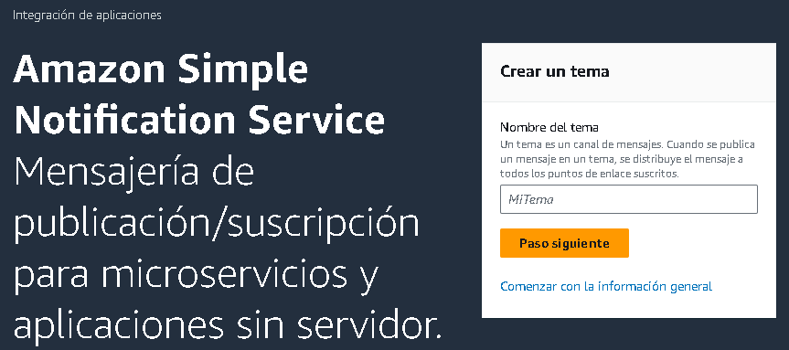
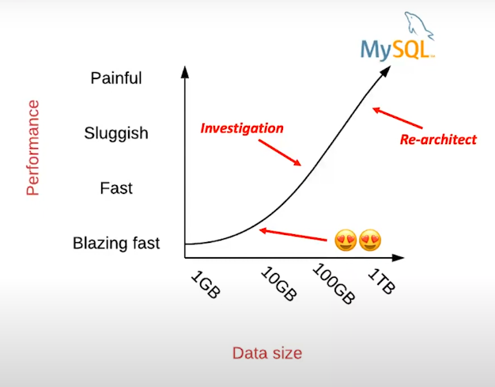
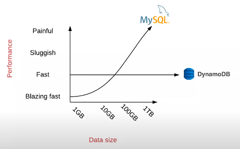
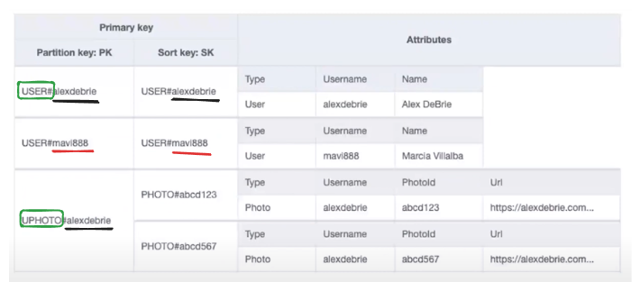

# 0.2. Nicolas Xavier Herrera Medina
---
# Demo de notificaciones

## Pasos

### Para AWS en la plataforma

1. Crearse una cuenta de AWS e ir al servicio de Simple Notification Service (SNS): <https://us-east-2.console.aws.amazon.com/sns/v3/home?region=us-east-2#/homepage>
2. Estando ahí, crear el tema para SNS llamado "General".



3. Elegir el protocolo de email, pues el formato que se usará para enviar las notificaciones al usuario

### Para el código

1. Crear un entorno virtual e inicializalo para mantener las dependencias del proyecto aisladas. Puedes hacerlo con los siguientes comandos:

    - En Linux:

    ```sh
    python -m venv venv
    source venv/bin/activate  
    ```

    - En Windows:

    ```sh
    venv\Scripts\activate
    ```

2. **Instalar las dependencias necesarias para conectarse con AWS (boto3)**

    Instala las librerías necesarias, incluyendo `boto3` para interactuar con AWS y `python-dotenv` para manejar las variables de entorno:

    ```sh
    pip install boto3 python-dotenv
    ```

3. Para configurar las variables de entorno, crea un archivo `.env` en el directorio raíz del proyecto y añade las siguientes variables de entorno con tus credenciales de AWS:

    ```env
    ACCESS_KEY_ID=your_access_key_id
    SECRET_ACCESS_KEY=your_secret_access_key
    ARN=your_sns_topic_arn
    ```

4. Crear la clase de NotificationManager y cuando se inicialice crear dos clientes: Uno para DynamoDB y otro para AWS SNS. De esta manera, solo se inicializan una vez (Singleton) y es utilizado para las funciones que lo requieren.

5. Crear las funciones para guardar y consultar registros de DynamoDB; y crear las funciones para enviar los tipos de notificaciones

## Parte técnica

### Notificaciones

Estoy desarrollando un sistema de notificaciones:

1. **Suscripción:** Indica que el usuario está suscrito. Sirve para que el usuario reciba correos electrónicos con las ofertas de los salones de belleza a los que sigue.
2. **Recordatorios:** Se envían correos electrónicos al usuario sobre su reserva, indicando la hora, el lugar y el servicio reservado.
3. **Ofertas:** Cuando un salón de belleza publica una oferta, se envía una notificación al usuario.

### Requisitos

- Los usuarios pueden estar suscritos a múltiples salones de belleza. Cuando un usuario se desuscribe de un salón de belleza, su atributo "Active" se cambia a False
- El sistema tiene un solo tema de SNS llamado **General** para manejar las notificaciones de múltiples salones de belleza a largo plazo. Los **message attributes** de SNS se usarán para enviar correos electrónicos de acuerdo al tipo de notificación, con contenido personalizado. Esto permite que se pueda personalizar más el contenido
- La clave de partición de esta tabla es está formada por el UserID#SalonID#TypeBehaviour. Así se tiene un acceso directo a la información. Además, la clave de ordenación es Timestamp para acceder más rápido a la información reciente.
- Asimismo se tiene un indice compuesto por SalonID#TypeBehaviour para poder hacer consultas rápidas para el envío masivo de notificaciones
- Conectado DynamoDB usando el cliente (`boto3.client('dynamodb')`) en lugar de usar `resource`, porque vi que resource a pesar de ser más moderna y abstracta los desarrolladores de boto dijeron que ya no recibirá actualizaciones. No está deprecada, pero no recibira actualizaciones próximas.

### Funciones

- Trae los usuarios que siguen un salon de belleza especifico
- Ingresa a la base de datos la información de las notificaciones
- Suscribe y desuscribe del tema "General". Y envía el correo para que el usuario decida hacerlo
- Envia la notificacion del recordatorio
- Envia la notificacion de ofertas
- Envia la oferta a todos los usuarios que siguen un salon de belleza en especifico

## Objetivo

- Se almacena la información en DynamoDB
- Se envia la información por SNS

[Base de Datos](BaseDeDatos.png)

## Parte Conceptual

### SQL vs NoSQL

A largo plazo mientras más información hay en una base relacional (SQL) más lento es el acceso a la información a pesar de usar indices u otras vías para optimizar las consultas



Mientras que **DynamoDB** es más consistente a pesar del tamaño de la información.



Aunque SQL puede ser un poco más rápido cuando hay poca información, a la larga DynamoDB se mantiene más estable con la velocidad de acceso. Además que en una aplicación en un entorno real donde se va adquiriendo constantemente más información, DynamoDB no se ve perjudicado en velocidad de acceso a la información (Villalba & DeBrie, 2021).

#### SQL

Basicamente una base de datos son distintas tablas normalizadas que tienen la información de la aplicación. Y para acceder a la información se realizan consultas y se usan joins haciendo uso de las Primary Keys que sirven como identificador.

#### NoSQL (DynamoDB)

Por otro lado DynamoDB, es una base de datos donde la información se encuentra en una tabla. Por lo que el uso de joins para las consultas no existe, lo cual favorece la velocidad de consulta. Sin embargo, se compone prinicipalmente en dos apartados: Clave y Valor.

##### Estructura de registros

DynamoDB utiliza un esquema NoSQL basado en claves y valores. Existen dos formas de definir las claves:

- Clave primaria simple: Es un identificador único conocido como Partition Key (PK). Se utiliza para tablas que necesitan acceder a cada registro mediante un solo identificador. Sin embargo, esta opción es menos utilizada en sistemas complejos, ya que limita las consultas a devolver solo un valor por cada clave.

- Clave primaria compuesta:

Se compone de dos partes:

- Partition Key (PK): Identificador global único en la tabla, utilizado para agrupar datos. Todos los registros que comparten la misma Partition Key pertenecen al mismo grupo lógico.
- Sort Key (SK): Define un orden dentro de los registros que comparten la misma Partition Key. Este enfoque permite almacenar y acceder a varios registros bajo la misma PK, facilitando la organización y optimización de las consultas.

###### Ventajas de la Clave Compuesta

Búsqueda más eficiente: En lugar de escanear toda la tabla registro por registro, DynamoDB optimiza las búsquedas usando la Partition Key. Al tener los datos segregados, la consulta se restringe solo a los registros que comparten la misma PK. Si además conocemos el valor de la Sort Key, se accede de manera directa al registro exacto, haciendo la búsqueda aún más rápida y económica (en términos de unidades de lectura).

###### Índices Secundarios: Acceso desde Múltiples Claves

Si necesitamos acceder a los datos usando otras claves, como un email o DNI, se pueden crear Índices Secundarios. DynamoDB ofrece dos tipos de índices:

- Índice Secundario Global (GSI): Permite crear índices basados en atributos que no forman parte de la clave primaria. Esto facilita consultas por diferentes campos, como el email de un usuario.

- Índice Secundario Local (LSI): Se basa en la misma Partition Key que la tabla principal, pero permite definir una Sort Key alternativa para ordenar los datos de forma distinta.

Al crear un índice, DynamoDB gestiona automáticamente una tabla interna sincronizada con la principal. Cada vez que los datos se actualizan en la tabla base, los índices se actualizan en segundo plano, asegurando que siempre estén en sincronía sin que el desarrollador tenga que preocuparse por este proceso (AWS, s.f).



### Clave:Valor vs. Columnares vs Documento

1. Bases de Datos Clave-Valor

**Descripción:**
Almacenan datos como pares clave: valor. Cada clave es única y apunta a un valor que puede ser un objeto simple o complejo (como una lista o un JSON) (AWS ,s.f).

**Ejemplos:**

- Amazon DynamoDB
- Redis
- Riak

**Ventajas:**

- Alta velocidad de acceso: Muy rápido para operaciones de lectura y escritura, ideal para cachés o búsquedas simples.
- Escalabilidad horizontal: Fácil de escalar mediante particionamiento (sharding).
- Sencillez: Modelo de datos simple, útil cuando no se necesita realizar consultas complejas.

**Desventajas:**

- Limitado en consultas: Solo permite búsquedas por clave exacta, no admite consultas complejas como filtros por varios campos.
- Rigidez del modelo: Si se requiere acceso a través de múltiples atributos, es necesario usar índices secundarios o diseñar el esquema con cuidado (como en DynamoDB).
- No apto para relaciones complejas: No maneja fácilmente relaciones entre diferentes entidades.

2. Bases de Datos Columnares

**Descripción:**

Almacenan los datos por columnas en lugar de filas. Cada columna pertenece a una familia y se agrupa lógicamente. Se optimizan para consultas analíticas de grandes volúmenes de datos donde no se accede a toda la fila, sino a columnas específicas.

**Ejemplos:**

- Apache Cassandra
- HBase
- Google Bigtable

**Ventajas:**

- Altamente eficiente para lectura de columnas específicas: Reduce I/O al no cargar toda la fila si solo se necesita una columna.
- Ideal para datos analíticos y series de tiempo: Maneja grandes volúmenes de datos con acceso rápido.
- Escalabilidad: Distribuye los datos eficientemente en múltiples nodos.

**Desventajas:**

- Menor flexibilidad para actualizaciones frecuentes: No es tan eficiente para casos donde se necesita modificar los datos con frecuencia.
- Más compleja de gestionar: Requiere planificación cuidadosa del esquema y familias de columnas.
- Bajo rendimiento en transacciones: No es ideal para operaciones que requieren consistencia fuerte.

3. Bases de Datos Documentales

**Descripción:**
Almacenan los datos como documentos en formato JSON, BSON, o XML. Cada documento es una entidad autónoma y puede tener una estructura flexible, lo que las hace ideales para almacenar datos semiestructurados.

**Ejemplos:**

- MongoDB
- CouchDB
- Amazon DocumentDB

**Ventajas:**

- Modelo flexible: Los documentos pueden tener esquemas variados, facilitando la adaptación a cambios en los datos.
- Adecuado para datos semiestructurados: Ideal para aplicaciones que manejan datos heterogéneos o sin un esquema fijo.
- Consultas ricas: Soporta consultas complejas sobre múltiples campos dentro del documento.

**Desventajas:**

- Limitaciones en consultas relacionales: No es eficiente para operaciones complejas entre documentos relacionados.
- Mayor consumo de espacio: La redundancia en los documentos puede aumentar el almacenamiento.
- Rendimiento inferior en comparaciones con cachés: No es tan rápido como las bases de datos clave-valor para búsquedas simples.

#### Resumen de comparación

| Criterio | Clave-Valor| Columnar| Documental  |
|---|---|---|---|
| **Ejemplos** | DynamoDB, Redis             | Cassandra, HBase          | MongoDB, CouchDB          |
| **Modelo de datos** | Clave: valor            | Columnas por familias     | Documentos JSON/BSON/XML  |
| **Uso ideal** | Cachés, configuraciones     | Análisis masivo, series de tiempo | Datos semiestructurados  |
| **Escalabilidad** | Alta                      | Alta                      | Alta                      |
| **Consultas** | Por clave exacta            | Por columnas              | Consultas ricas           |
| **Rendimiento** | Muy rápido                 | Rápido en columnas        | Rápido                    |
| **Flexibilidad** | Baja                      | Media                     | Alta                      |

### Contenido extra

- Es otra demo completo para el uso y buenas prácticas de DynamoDB: <https://github.com/alexdebrie/dynamodb-instagram> (Villalba & DeBrie, 2021)

- Es la documentación de boto3: <https://boto3.amazonaws.com/v1/documentation/api/latest/reference/services/dynamodb.html> (AWS (s.f))

## Fuentes

1. Villalba, M. & DeBrie, A. (2021) 7 Common DynamoDB Patterns for Modeling and Building an App with Alex De Brie. <https://youtu.be/Q6-qWdsa8a4?si=4sdk9nbQRbibaAn3>
2. AWS (s.f). Introducción a DynamoDB. <https://docs.aws.amazon.com/es_es/amazondynamodb/latest/developerguide/Introduction.html>
3. AWS (s.f). Casos de Uso. <https://docs.aws.amazon.com/es_es/amazondynamodb/latest/developerguide/Introduction.html#ddb-characteristics>
4. AWS (s.f). Documentación. <https://boto3.amazonaws.com/v1/documentation/api/latest/reference/services/dynamodb.html>

--- 
Link al vídeo de Youtube: <https://youtu.be/lDK_xfvxP-M>

Link al repositorio de la demo : <https://github.com/NXHM/demo-notifications-publico/blob/main/demo-notifications/README.md> 
