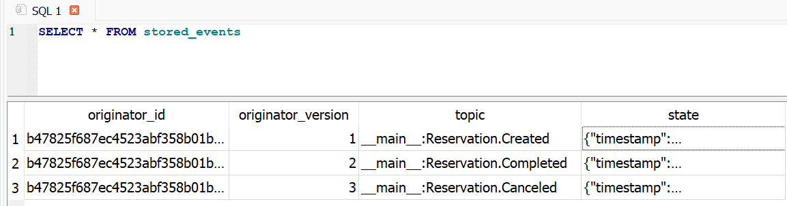
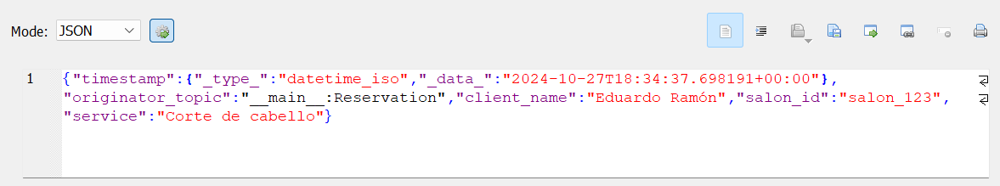

# 0.4. Lambda AWS - Eduardo Ramón

## Informe Teórico

Según Amazon, "[AWS Lambda](https://aws.amazon.com/es/lambda/) es un servicio informático sin servidor, que ejecuta código en respuesta a eventos y administra los recursos informáticos por usted". De esta manera, los desarrolladores pueden centrarse en escribir código y mejorar la experiencia del usuario, mientras AWS se encarga de la infraestructura.

### ¿Cómo funciona AWS Lambda?

Como fue dicho, Lambda ejecuta código en respuesta a eventos como cargas de archivos en Amazon S3, cambios en tablas de una base de datos como DynamoDB, datos recibidos en flujos de Amazon Kinesis o solicitudes HTTP mediante API Gateway, entre otros.

#### Características Clave:

- **Costo por uso:** Se paga solo por el tiempo que el código se ejecuta.
- **Soporte para varios lenguajes:** Como Node.js, Python, Java, entre otros, e incluso permite cargar un propio `runtime` en cualquier lenguaje de programación.
- **Integración con otros servicios de AWS:** S3, DynamoDB, Kinesis, SNS, entre otros.
- **Escalabilidad automática:** Lambda ajusta automáticamente la cantidad de recursos asignados dependiendo de la carga.

### Casos Prácticos

#### Procesamiento en Tiempo Real

La transformación de imágenes o la manipulación de archivos subidos a un S3 en tiempo real pueden ser realizados por Lambda. También puede ser utilizado para generar respuestas rápidas a eventos, como en sistemas de monitoreo o en aplicaciones con lógica en tiempo real.

#### Automatización de Tareas

Puedes usar Lambda para automatizar tareas de backend. Por ejemplo, cuando un usuario sube un archivo a S3, Lambda puede procesar automáticamente ese archivo (comprimirlo, indexarlo, o convertirlo a otro formato).

#### API sin Servidor

Lambda es ideal para construir APIs RESTful usando AWS API Gateway. Esto permite que las aplicaciones móviles y web se comuniquen con el backend de manera eficiente, sin la necesidad de gestionar servidores tradicionales.

### Ventajas de AWS Lambda

- **Reducción en la gestión de infraestructura** Con Lambda, no es necesario mantener servidores físicos ni virtuales. AWS se encarga de la administración, escalado y parches de seguridad.

- **Escalabilidad automática** Lambda se escala automáticamente en función de la demanda, asegurando que las aplicaciones respondan adecuadamente en momentos de alta carga.

- **Bajo costo** No hay costos iniciales. Solo pagas por las ejecuciones que se realizan. Además, Lambda forma parte del nivel gratuito de AWS, permitiendo que los nuevos usuarios lo prueben sin costo alguno hasta ciertos límites.

- **Facilidad de uso** Se puede usar código existente y subirlo como un archivo comprimido (ZIP). También puedes escribir código directamente desde la consola de AWS, y no necesitas aprender nuevas herramientas o lenguajes.

### Limitaciones de AWS Lambda

- **Tiempo máximo de ejecución** Las funciones Lambda tienen un tiempo máximo de ejecución de 15 minutos.

- **Restricciones en memoria y almacenamiento** La memoria asignada puede variar entre 128 MB y 10 GB. El tamaño del código comprimido no puede exceder los 50 MB, y el descomprimido tiene un límite de 250 MB.

- **Invocaciones simultáneas** Lambda tiene un límite de 1000 invocaciones simultáneas por región, aunque este límite se puede aumentar bajo solicitud.

- **No apto para cargas constantes** Lambda está diseñado para tareas pequeñas e intermitentes. Para aplicaciones con cargas constantes o procesos de larga duración, puede no ser la mejor opción.

### Cuándo Usar AWS Lambda

- **Procesamiento de eventos en tiempo real**: como cargar archivos, procesar imágenes o manejar streams de datos.
- **Automatización de tareas backend**: ideal para ejecutar tareas intermitentes, como la gestión de notificaciones o la actualización de bases de datos.
- **Desarrollo de microservicios**: puedes implementar microservicios ligeros que respondan a eventos específicos sin necesidad de gestionar infraestructura adicional.

### Cuándo No Usar AWS Lambda

- **Tareas largas o computacionalmente intensivas**: debido a las limitaciones de tiempo y recursos, Lambda no es adecuado para procesos complejos o que necesiten más de 15 minutos.
- **Cargas de trabajo constantes o a gran escala**: para cargas de trabajo que requieren recursos constantemente activos, una solución tradicional basada en servidores o contenedores puede ser más adecuada.

## Informe Técnico

Como se mencionó previamente, AWS Lambda es ideal para tareas intermitentes que se ejecutan de forma regular, pero no requieren tiempos prolongados de procesamiento. Por esta razón, en el módulo de analíticas y generación de reportes de InStudio, se adoptó un enfoque basado en eventos (Event-Driven), ya que se ajusta perfectamente al modelo de negocio y permite aprovechar las ventajas de este servicio. A continuación se muestra la estructura de los componentes utilizados y la relación entre ellos:

- **Eventos de Reserva:** Al realizar una nueva reserva, se genera un evento que es capturado por un servicio de mensajería (Kafka).
- **Función Lambda:** Este evento activa una función Lambda que procesa la información de la reserva generada y la guarda en un archivo Parquet.
- **Almacenamiento en S3:** Los archivos Parquet generados por la función Lambda se almacenan en un bucket de Amazon S3.
- **Base de Datos Columnar:** Para el análisis, se utiliza DuckDB, que puede leer directamente desde los archivos Parquet almacenados en S3.
- **Generación de Reportes:** Desde DuckDB, se pueden generar reportes que se envían a los salones de belleza con métricas clave sobre sus reservas.

En cuanto al motivo de selección de cada tecnología, se ha optado por utilizar un formato de almacenamiento columnar, como Parquet, para la generación de métricas y reportes, ya que según IBM, ofrece una gestión más eficiente tanto del almacenamiento como de la recuperación de datos, optimizando el espacio y mejorando los tiempos de consulta. Por esta razón, cada vez que se registre una reserva, una función Lambda se encargará de formatear aquella información en un archivo Parquet y almacenarlo en S3, un servicio de almacenamiento de objetos que ofrece escalabilidad, disponibilidad de datos, seguridad y rendimiento. Para el análisis, se ha elegido DuckDB, un motor diseñado para manejar datos columnares, que permite ejecutar consultas analíticas a gran velocidad, admite procesamiento paralelo y es capaz de gestionar cargas de trabajo que exceden la memoria disponible. A continuación, por la temática tratada, se mostrará exclusivamente la implementación de la función y cómo carga los resultados a Amazon S3.

### Implementación de la función Lambda

La función Lambda fue desarrollada utilizando Python 3.10 para gestionar las reservas y almacenar los datos en formato Parquet dentro de un bucket S3. Con anterioridad, ya fue creada la entidad s3 y se habilitaron los permisos mediante AWS IAM para que la función lambda pueda subir archivos. A continuación se detallan algunos aspectos clave del proceso:

#### Simulación del evento

Para probar la función Lambda, se simuló un evento utilizando el siguiente payload. Este payload contiene un mensaje de ejemplo que incluye los detalles de la reserva, como el `booking_id`, `booking_date`, `status` y otros identificadores relevantes.

```
{
  "Records": [
    {
      "messageId": "1",
      "receiptHandle": "SomeReceiptHandle",
      "body": "{\"booking_id\": 1, \"booking_date\": \"2024-10-06T20:00:00\", \"status\": 1, \"user_id\": 1, \"salon_id\": 1, \"employee_id\": 1, \"payment_id\": 1}",
      "attributes": {
        "ApproximateReceiveCount": "1",
        "SentTimestamp": "1626469652051",
        "SenderId": "SomeSenderId",
        "ApproximateFirstReceiveTimestamp": "1626469652053"
      },
      "messageAttributes": {},
      "md5OfBody": "SomeMD5Hash",
      "eventSource": "aws:sqs",
      "eventSourceARN": "arn:aws:sqs:us-east-1:123456789012:queue-name",
      "awsRegion": "us-east-1"
    }
  ]
}
```

#### Dependencias y entorno de ejecución

Dado que la función requiere el uso de librerías que no están soportadas nativamente en Lambda, como pyarrow y numpy, se intentó utilizar capas (`layers`) para incorporarlas. Sin embargo, debido a que el tamaño combinado de las dependencias excedía el límite permitido, se decidió implementar la función Lambda dentro de un contenedor Docker, lo que permitió incluir las librerías necesarias sin restricciones de espacio.

```
import json
import boto3
import uuid
from datetime import datetime
import pyarrow as pa
import pyarrow.parquet as pq

def handler(event, context):
    s3_client = boto3.client('s3')
    BUCKET_NAME = 'analytics-bucket-s3'
    PREFIX = 'bookings/'

    for record in event['Records']:
        mensaje = json.loads(record['body'])

        # Crear un esquema de Parquet
        schema = pa.schema([
            ('booking_id', pa.int32()),
            ('booking_date', pa.timestamp('s')),
            ('status', pa.int32()),
            ('user_id', pa.int32()),
            ('salon_id', pa.int32()),
            ('employee_id', pa.int32()),
            ('payment_id', pa.int32())
        ])

        booking_date_str = mensaje['booking_date']
        booking_date = datetime.fromisoformat(booking_date_str)

        # Crear una tabla de Parquet
        table = pa.Table.from_pydict({
            'booking_id': [mensaje['booking_id']],
            'booking_date': [booking_date],
            'status': [mensaje['status']],
            'user_id': [mensaje['user_id']],
            'salon_id': [mensaje['salon_id']],
            'employee_id': [mensaje['employee_id']],
            'payment_id': [mensaje['payment_id']]
        }, schema=schema)

        # Generar un nombre único para el archivo Parquet
        timestamp = datetime.utcnow().strftime('%Y-%m-%dT%H-%M-%S')
        file_name = f"{timestamp}_{uuid.uuid4()}.parquet"

        # Escribir el archivo Parquet en S3
        pq.write_table(table, f"/tmp/{file_name}")
        s3_client.upload_file(f"/tmp/{file_name}", BUCKET_NAME, file_name)

        print(f"Reserva {mensaje['booking_id']} almacenada en {file_name}")
```

#### Detalle del proceso

La función realiza las siguientes tareas:

- **Lectura del evento:** Extrae el mensaje del evento que contiene los detalles de la reserva.
- **Esquema de Parquet:** Define un esquema para el archivo Parquet, asegurando que cada campo tenga el tipo de datos adecuado.
- **Conversión de datos:** Transforma los datos recibidos en una tabla Parquet utilizando el esquema definido.
- **Generación del archivo Parquet:** Crea un archivo Parquet en el almacenamiento temporal de Lambda, nombrándolo con un identificador único generado mediante uuid y un timestamp de la fecha actual.
- **Subida a S3:** Finalmente, el archivo es subido al bucket S3, en este caso, `analytics-bucket-s3`, bajo la carpeta `bookings/`.

Este enfoque asegura que cada reserva procesada por la función Lambda se almacene en un archivo Parquet dentro de S3, lo que facilita el análisis posterior mediante consultas eficientes gracias a su formato columnar.

## Enlace

Video: https://youtu.be/n4TCDfc_5QY
Repositorio para procesamiento de eventos: https://github.com/Edurz135/process-booking-docker
Repositorio para análisis de datos: https://github.com/Edurz135/duckdb-s3-docker

## Referencias

AWS | Lambda - Gestión de recursos informáticos. (n.d.). Amazon Web Services, Inc. https://aws.amazon.com/es/lambda/

AWS | Almacenamiento de datos seguro en la nube (S3). (n.d.). Amazon Web Services, Inc. https://aws.amazon.com/es/s3/

DuckDB (2024, October 11). An in-process SQL OLAP database management system. DuckDB. https://duckdb.org/

IBM Storage Ceph. (n.d.). https://www.ibm.com/docs/es/storage-ceph/7?topic=explained-s3-parquet-parsing

# 0.4. Event Sourcing - Eduardo Ramón

## Definición

Event Sourcing es un patrón de diseño que registra cada cambio en los datos como un evento inmutable en un append-only store, en lugar de almacenar solo el estado actual. Este registro sirve como fuente de verdad y permite reconstruir el estado completo de los objetos del dominio cuando se necesite.

## Problema

En los sistemas distribuidos y arquitecturas orientadas a eventos (_event-driven_), la gestión de cambios en entidades de negocio presenta varios desafíos críticos:

### 1. Consistencia de datos

Cuando un servicio necesita actualizar una base de datos y notificar a otros servicios mediante eventos, pueden surgir escenarios problemáticos:

- Si la actualización de la base de datos es exitosa pero falla el envío del evento
- Si el evento se envía pero falla la actualización de la base de datos
- Si las operaciones no se ejecutan en el orden correcto

### 2. Historial y trazabilidad

Los sistemas tradicionales suelen enfocarse en mantener solo el estado actual, lo que resulta en:

- Pérdida de información histórica valiosa
- Dificultad para realizar auditorías
- Imposibilidad de consultar estados anteriores de una entidad

### 3. Ordenamiento en sistemas distribuidos

En entornos donde múltiples instancias de un servicio pueden modificar la misma entidad:

- Es complejo garantizar el orden correcto de los eventos
- Pueden producirse condiciones de carrera
- Existe riesgo de inconsistencias por eventos desordenados

## Solución:

Event Sourcing transforma la manera de gestionar el estado de las entidades, almacenando cada cambio como un evento inmutable en una secuencia temporal.

### 1. Gestión atómica de cambios

- **Enfoque**: Cada modificación se registra como un único evento inmutable
- **Beneficio**: Elimina la necesidad de coordinar múltiples operaciones
- **Resultado**: Garantiza la consistencia del sistema de manera natural

### 2. Trazabilidad completa

- **Registro**: Cada evento representa una acción específica sobre la entidad
- **Historial**: Mantiene una secuencia cronológica completa de cambios
- **Capacidad**: Permite reconstruir el estado de cualquier entidad en cualquier momento

### 3. Control de orden

- **Secuencia**: Los eventos se almacenan en orden estricto
- **Garantía**: Asegura la propagación coherente de cambios
- **Confiabilidad**: Mantiene la integridad en sistemas distribuidos

Este enfoque no solo resuelve los problemas técnicos inmediatos, sino que también proporciona beneficios adicionales como:

- Mayor capacidad de análisis de datos históricos
- Facilidad para implementar nuevas funcionalidades basadas en eventos
- Mejor comprensión del comportamiento del sistema

## Casos de uso de Event Sourcing

### 1. Sistemas financieros y trading

En los sistemas financieros y de trading, Event Sourcing se ha utilizado, especialmente en el sector bancario y el trading de alta frecuencia. Este enfoque permite un registro preciso y cronológico de todas las transacciones, lo que es esencial para cumplir con los requisitos regulatorios del sector, facilitando la reconstrucción de secuencias de operaciones para su análisis y **auditoría**. En la banca digital, se utiliza para registrar transacciones en tiempo real, mejorando la **detección de fraudes** y facilitando la conciliación automática de cuentas.

### 2. Microservicios en e-commerce

En soluciones de e-commerce basadas en microservicios, Event Sourcing ayuda a mantener la consistencia de los datos en sistemas distribuidos, especialmente en operaciones complejas como la gestión de inventarios y pedidos.

Event Sourcing permite un seguimiento preciso del stock en tiempo real, lo que facilita la reserva de productos y la gestión de backorders. Además, mejora la trazabilidad en el procesamiento de pedidos y permite una mejor integración con sistemas de logística y manejo de devoluciones.

## Event sourcing y otros patrones

Se ha identificado que Event Souring suele ser utilizado con los patrones CQRS Y Saga, por lo que se explicará la relación entre ellos:

CQRS complementa a Event Sourcing al dividir las responsabilidades de lectura y escritura. Mientras Event Sourcing se encarga de registrar la historia completa de cada cambio como eventos inmutables, CQRS aprovecha estos eventos para crear vistas especializadas y optimizadas. Esto permite, por ejemplo, tener una vista simplificada para mostrar el estado actual de una reserva, mientras se mantiene separado el registro detallado de cómo se llegó a ese estado.

Saga, por su parte, trabaja en conjunto con Event Sourcing para manejar flujos distribuidos complejos. Event Sourcing garantiza que cada paso en una transacción quede registrado de manera inmutable, mientras que Saga se encarga de coordinar la secuencia correcta de estos eventos entre diferentes servicios. Si algo falla en medio del proceso, Saga puede usar el registro de eventos para determinar qué pasos de compensación son necesarios para mantener la consistencia del sistema.

Esta combinación de patrones resulta en una arquitectura robusta que mantiene un historial confiable y auditable (Event Sourcing), proporciona consultas eficientes adaptadas a diferentes necesidades (CQRS), y maneja de manera confiable transacciones distribuidas complejas que involucran múltiples servicios (Saga). Cada patrón aporta sus fortalezas específicas mientras complementa las capacidades de los otros.

## Aplicación en el trabajo grupal

En sistemas de reservas, registrar únicamente el estado actual de cada reserva dificulta el seguimiento de cambios y la visibilidad del proceso completo, desde la creación hasta la finalización del servicio. Esto se complica aún más en entornos de microservicios, donde múltiples módulos deben mantener la coherencia de los datos.

El patrón Event Sourcing resuelve este problema al registrar cada cambio de estado de una reserva como un evento independiente. Esto permite que cada módulo procese estos eventos de manera autónoma, asegurando la consistencia de los datos. Al tener un registro completo de todas las transiciones, se facilita el análisis de tiempos clave, la identificación de ineficiencias en el flujo de atención al cliente e incluso, facilitar la identificación de patrones en la tasa de cancelación de reservas.

## Desarrollo de código y demo

Para implementar el patrón de Event Sourcing, desarrollé una demostración para la gestión de reservas en la plataforma InStudio. Originalmente, se planeó almacenar solo el estado actual de las reservas; sin embargo, esto generaba una pérdida de información sobre cuándo ocurrían los cambios de estado, lo cual es crucial para posteriormente analizar estos datos y encontrar patrones importantes. Aplicando Event Sourcing, ahora se garantiza un historial detallado de eventos (creación, cancelación, finalización) que permite rastrear cada modificación en el estado de las reservas y mejora la consistencia de los datos.

### Proceso de implementación

La implementación se dividió en varios pasos clave. Para ello, se utilizó la librería `eventsourcing` y Python 3.10.11:

1. **Creación de la Clase Reservation:** Se definió `Reservation` como el agregado principal, con eventos asociados a cada cambio de estado.

2. **Construcción de InStudioApplication:** Esta aplicación gestiona la lógica de negocio y ofrece métodos para registrar, cancelar y completar reservas, controlando el flujo y la persistencia de eventos.

3. **Configuración del Repositorio SQLite:** Se utilizó SQLite como sistema de almacenamiento para los eventos, proporcionando un repositorio persistente que registra cada modificación de estado.

### Validación y prueba

Para validar el correcto funcionamiento de la aplicación, se desarrolló una prueba que confirma que los eventos de estado son registrados y recuperados con precisión. Esto asegura que cada evento de la reserva queda almacenado y puede ser consultado en cualquier momento, lo que es fundamental para el análisis y auditoría de los datos. A continuación se mostrará y explicará cada bloque de código para llevar a cabo la demostración.

### Código

```python
from eventsourcing.domain import Aggregate, event
from eventsourcing.application import Application
import os

os.environ["PERSISTENCE_MODULE"] = 'eventsourcing.sqlite'
os.environ["SQLITE_DBNAME"] = 'instudio.db'
```

Aquí se configura el entorno para el almacenamiento de eventos. Se utiliza SQLite como base de datos para persistir los eventos, y se define el nombre del archivo de la base de datos como instudio.db.

```python
class Reservation(Aggregate):
  @event('Created')
  def __init__(self, client_name, salon_id, service):
    self.client_name = client_name
    self.salon_id = salon_id
    self.service = service
    self.status = "Pending"

  @event('Canceled')
  def cancel(self):
    self.status = "Canceled"

  @event('Completed')
  def complete(self):
    self.status = "Completed"
```

Aquí se define la clase Reservation, que representa la reserva como un agregado de dominio. Esta clase maneja tres eventos principales:

- Creación (Created): Registra una nueva reserva con el estado inicial "Pending".
- Cancelación (Canceled): Cambia el estado de la reserva a "Canceled".
- Finalización (Completed): Cambia el estado de la reserva a "Completed".

Cada cambio de estado está decorado con @event, lo que asegura que se registre en el historial de eventos.

```python
class InStudioApplication(Application):
    def create_reservation(self, client_name, salon_id, service):
        reservation = Reservation(client_name, salon_id, service)
        self.save(reservation)
        return reservation.id

    def cancel_reservation(self, reservation_id):
        reservation = self.repository.get(reservation_id)
        reservation.cancel()
        self.save(reservation)

    def complete_reservation(self, reservation_id):
        reservation = self.repository.get(reservation_id)
        reservation.complete()
        self.save(reservation)

    def get_reservation(self, reservation_id):
        reservation = self.repository.get(reservation_id)
        return {
            'client_name': reservation.client_name,
            'salon_id': reservation.salon_id,
            'service': reservation.service,
            'status': reservation.status
        }
```

InStudioApplication actúa como la capa de aplicación que gestiona las operaciones sobre las reservas. Sus métodos incluyen:

- create_reservation: Crea una nueva reserva y la guarda en el repositorio.
- cancel_reservation: Cancela una reserva existente utilizando su ID.
- complete_reservation: Marca una reserva como completada.
- get_reservation: Recupera los detalles actuales de una reserva, incluyendo el nombre del cliente, el servicio, y el estado.

Cada vez que se cambia el estado de una reserva, se guarda un evento en el repositorio, registrando así cada modificación en el tiempo.

```python
def test_instudio_application():
    instudio_app = InStudioApplication()

    reservation_id = instudio_app.create_reservation('Eduardo Ramón', 'salon_123', 'Corte de cabello')
    instudio_app.complete_reservation(reservation_id)

    reservation = instudio_app.get_reservation(reservation_id)
    assert reservation['client_name'] == 'Eduardo Ramón'
    assert reservation['status'] == 'Completed'

    instudio_app.cancel_reservation(reservation_id)
    reservation = instudio_app.get_reservation(reservation_id)
    assert reservation['status'] == 'Canceled'

    notifications = instudio_app.notification_log.select(start=1, limit=10)
    assert len(notifications) == 3

test_instudio_application()
```

La función test_instudio_application es una prueba unitaria para validar que las reservas se crean y gestionan correctamente. Se realizan los siguientes pasos:

- Crear una reserva para un cliente y completar el estado a "Completed".
- Cancelar la reserva y verificar que el estado cambia a "Canceled".
- Consultar el registro de notificaciones para confirmar que se han registrado tres eventos: creación, completado y cancelación.

Luego de ejecutar los bloques de código y efectuar las pruebas descritas, en la tabla `stored_events` de la base de datos SQLite, se registrarán todos los eventos generados.


Se puede apreciar los 3 eventos generados, entre ellos, la creación de la reserva como `Reservation.Created` y su cambio de estado a completada y cancelada como `Reservation.Completed` y `Reservation.Canceled` respectivamente.


Concretamente para el tópico de creación de reserva, se almacena el momento del evento y los atributos como `client_name`, `salon_id`, `service`, el cual permite tener un registro más descriptivo.

## Repositorio

https://github.com/Edurz135/EventSourcing

## Conclusiones

El patrón Event Sourcing almacena todos los cambios de estado como eventos, creando un historial completo e inmutable de la información. En lugar de solo mantener el estado actual, conserva la secuencia completa de modificaciones que llevaron a ese estado. Su integración con otros patrones fortalece la arquitectura del sistema, permitiendo manejar escenarios más complejos.

## Anexos

- Richardson, C. (s.f.). Pattern: Event sourcing. Microservices.io. https://microservices.io/patterns/data/event-sourcing.html
- Microsoft. (s. f.). Event Sourcing pattern. Microsoft Azure Architecture Center. https://learn.microsoft.com/en-us/azure/architecture/patterns/event-sourcing
- Klimov, A. (s. f.). Event Sourcing Explained: Benefits, Challenges, and Use Cases. Medium. https://medium.com/@alxkm/event-sourcing-explained-benefits-challenges-and-use-cases-d889dc96fc18

# 0.4. Monitoreo en la Nube - CloudWatch - Eduardo Ramón

## Definición

Según Amazon, Amazon CloudWatch es un servicio de monitoreo y observabilidad en la nube . Este servicio recopila y visualiza datos operativos en tiempo real en forma de registros, métricas y eventos, proporcionando una vista unificada de los recursos, aplicaciones y servicios que se ejecutan en AWS y en servidores locales. Es una herramienta bastante completa e integral debido a todas las funcionalidades que ofrece, entre sus principales características se pueden resaltar las siguientes:

- Recopilación automática de métricas
- Visualización de datos en tiempo real
- Configuración de alarmas y notificaciones
- Almacenamiento de logs centralizado
- Creación de paneles personalizados
- Análisis y correlación de eventos

## Problema

El servicio de Amazon CloudWatch supone una solución ante las siguientes problemáticas:

1. **Complejidad del entorno distribuido:** En los sistemas cloud modernos, múltiples servicios interconectados operan simultáneamente, con capas de aplicación variadas y una infraestructura dinámica que escala automáticamente, dificultando la monitorización de cada microservicio y tener una visión unificada del sistema.

2. **Visibilidad y diagnóstico:** La falta de visibilidad en sistemas distribuidos complica detectar problemas en tiempo real y dificulta la correlación de eventos entre servicios. Esto limita el contexto en los datos recolectados y prolonga el tiempo necesario para identificar la causa raíz de los incidentes.

3. **Gestión operativa:** La operación de sistemas cloud enfrenta retos de optimización de costos, rendimiento inconsistente entre componentes y problemas imprevistos de capacidad y escalabilidad, lo que hace difícil mantener los niveles de servicio (SLAs) acordados.

## Solución:

CloudWatch proporciona una solución integral de monitoreo y observabilidad que aborda estos desafíos fundamentales:

1. **Monitoreo unificado:** CloudWatch recopila automáticamente métricas de más de 70 servicios de AWS y permite monitoreo personalizado de aplicaciones propias. Esto proporciona visibilidad end-to-end de la infraestructura cloud y centraliza los logs y métricas en un solo lugar.

2. **Análisis en tiempo real:** Con dashboards personalizables y métricas detalladas de hasta 1 segundo de resolución, CloudWatch facilita la visualización y correlación de eventos, logs y métricas. Además, detecta automáticamente anomalías y patrones, ofreciendo insights inmediatos.

3. **Automatización y respuesta:** CloudWatch incluye un sistema de alertas configurables y permite respuestas automáticas mediante integración con AWS Lambda. Esta proactividad permite detectar y responder tempranamente a problemas potenciales.

Este enfoque no solo resuelve los problemas técnicos inmediatos, sino que también proporciona beneficios adicionales como:

- Mejor visibilidad del estado general del sistema
- Reducción significativa del tiempo de resolución de incidentes
- Optimización proactiva de recursos y costos

## Casos de uso de CloudWatch

1. **Monitoreo de aplicaciones empresariales:** CloudWatch permite un monitoreo continuo y proactivo del rendimiento de aplicaciones críticas. Genera alertas sobre problemas potenciales, realiza análisis de patrones de uso y ayuda a optimizar el rendimiento basándose en datos reales.

2. **Infraestructura y microservicios:** En arquitecturas de microservicios, CloudWatch facilita el monitoreo detallado de cada servicio, correlaciona eventos entre componentes, gestiona logs distribuidos y optimiza recursos y costos operativos.

3. **Seguridad y cumplimiento:** CloudWatch es clave para la seguridad y el cumplimiento, ya que permite detectar amenazas, llevar registros de auditoría, monitorear cambios en configuraciones y cumplir con normativas regulatorias.

## Aplicación en el trabajo grupal
En InStudio, implementar CloudWatch permitiría monitorear detalladamente el rendimiento de los microservicios y la infraestructura que soportan la plataforma. Se podría rastrear el uso de recursos como la CPU, memoria, entre otros, para evitar cuellos de botella y optimizar la asignación de recursos. También se podría configurar alertas para detectar cuando el uso de CPU o memoria alcanza un umbral crítico, para responder rápidamente a posibles problemas de disponibilidad o rendimiento. Utilizar dashboards para visualizar tendencias en el tráfico, uso de recursos y patrones de actividad de los usuarios.

## Desarrollo de código y demo
Se configuró el CloudWatch Agent para monitorear el rendimiento de una instancia de EC2. Se realizaron pruebas de estrés para evaluar el comportamiento bajo carga, y se generó un dashboard dinámico para visualizar en tiempo real el rendimiento de la máquina. Para obtener más detalles y una explicación completa del proceso, puedes consultar el repositorio en el siguiente enlace:

## Repositorio
https://github.com/Edurz135/Cloud_Monitoring_CW

## Referencias

https://aws.amazon.com/cloudwatch/
