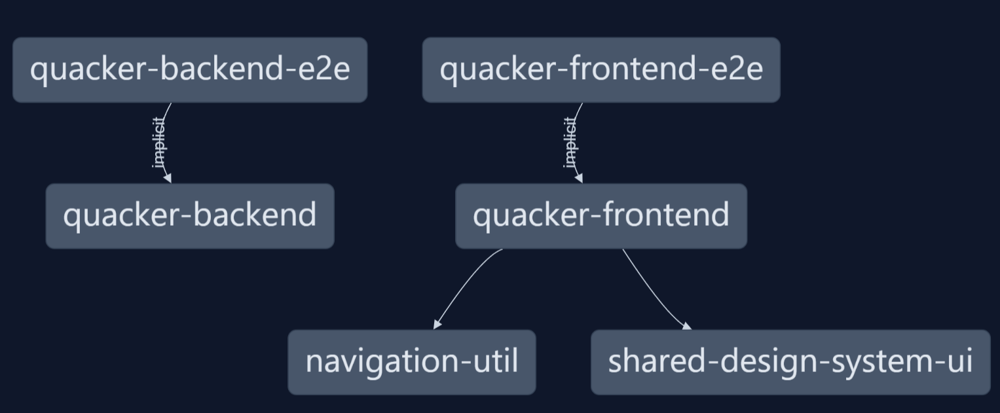

# 0.5. Monorepo - Flavio Zegarra

# 1. Informe Teórico
Un Monorepo (abreviatura de "monolithic repository") es una estrategia de gestión de código fuente donde múltiples proyectos o componentes se almacenan dentro de un único repositorio de control de versiones, en lugar de distribuir cada proyecto en repositorios separados (como es común en un multirepo).

## 1.1. Diferencias entre monorepo, multirepo y monolito 
El término Monorepo hace referencia a una estrategia en la que todos los proyectos, componentes o servicios se almacenan en un solo repositorio de control de versiones. Cada proyecto puede ser independiente o estar relacionado con otros, pero todos comparten el mismo espacio de almacenamiento. Esto facilita facilita la gestión centralizada de dependencias, cambios y versiones, lo que permite a los equipos colaborar más estrechamente y mantener una visión unificada del estado del código. Pero por otro lado, también puede conllevar desafíos relacionados con el escalado y la gestión de grandes volúmenes de código.

Por otro lado, un Multirepo es una estrategia que distribuye cada proyecto, servicio o módulo en su propio repositorio de control de versiones. Esto permite que los equipos trabajen de forma más independiente, ya que cada repositorio es autónomo y separado de los demás. La ventaja de esta estructura es que facilita la escalabilidad organizativa, ya que los equipos pueden tener mayor control y autonomía sobre su propio código. Sin embargo, también puede introducir problemas de coordinación entre los diferentes repositorios, ya que las dependencias entre ellos no se gestionan de manera centralizada.

Finalmente, un Monolito no está relacionado directamente con la organización del repositorio, sino con la estructura de la arquitectura del software. En una aplicación monolítica, todo el código que compone la aplicación, incluida la interfaz de usuario, la lógica de negocio y el acceso a la base de datos, se encuentra en un solo proyecto o servicio indivisible. Aunque un monolito puede estar alojado en un monorepo, ambos conceptos son diferentes: el monolito se refiere a cómo está estructurado el software en sí, mientras que el monorepo es una forma de organizar el código en un único repositorio.

## 1.2. Beneficios
### 1.2.1. Colaboración Simplificada
Al trabajar todos los equipos en un único repositorio, se vuelve más fluida la coordinación y colaboración entre desarrolladores. Además, tener acceso a todo el código fomenta la transparencia y la consistencia en las prácticas de desarrollo. Por otro lado, el riesgo de conflictos de integración se ve reducida ya que los equipos pueden identificar y solucionar problemas más rápidamente al estar todos los componentes en el mismo espacio.

### 1.2.2. Reutilización de Código
La reutilización de librerías y módulos es mucho más eficiente ya que en lugar de duplicar código entre distintos proyectos, los equipos pueden centralizar y compartir código común en todo el repositorio. De esta manera se pueden evitar problemas de mantenimiento que suelen ocurrir en un multirepo, donde los equipos tienden a copiar y pegar código entre diferentes repositorios. Por ejemplo, una empresa de comercio electrónico con múltiples microservicios (gestión de productos, pagos, envíos) puede compartir una misma biblioteca para manejar la lógica de precios o impuestos. Las mejoras o correcciones en esta lógica se reflejan automáticamente en todos los servicios, mejorando la eficiencia y reduciendo errores.

### 1.2.3. Visibilidad Global
Al tener todos los proyectos y sus dependencias en un solo lugar, se proporciona una visión clara y global del ecosistema de la aplicación. Esto puede ser útil cuando surgen incompatibilidades entre servicios, ya que los desarrolladores pueden investigar y resolver problemas sin tener que saltar entre todos los repositorios existentes. Esta visibilidad también ayuda a mejorar la calidad del código y a mantener una arquitectura coherente entre los diferentes componentes.

### 1.2.4. Mejor Integración Continua
Al centralizar todo el código en un único repositorio, se facilita la automatización de pruebas, compilaciones y despliegues, y de esta manera se vuelven más eficientes los flujos de trabajo de Integración Continua (CI) y Despliegue Continuo (CD). La CI implica que los desarrolladores integren su código en un repositorio común varias veces al día, lo que permite detectar errores de integración de manera temprana. El CD, por su parte, automatiza el proceso de despliegue del código en entornos de producción o preproducción, una vez que ha pasado todas las pruebas. Un pipeline de CI/CD, compuesto por pasos automatizados, lleva el código desde la fase de desarrollo hasta la producción de forma rápida y segura, lo que reduce tiempos y mejora la calidad del software entregado.

## 1.3. Desafíos y Desventajas

### 1.3.1. Escalabilidad
A medida que el repositorio crece, se puede volver más difícil de escalar y mantener. La acumulación de múltiples proyectos, librerías y servicios en un solo repositorio puede generar una gran carga en las herramientas de desarrollo y en los sistemas de control de versiones. Si no se implementan estrategias de gestión adecuadas, el tamaño del repositorio puede convertirse en un problema, afectando tanto el rendimiento de las operaciones como la experiencia de los desarrolladores. Para mitigar estos problemas, es necesario implementar prácticas como la división lógica de carpetas o el uso de submódulos, pero esto añade complejidad al proceso de gestión.

### 1.3.2. Rendimiento
Operaciones básicas de control de versiones como git clone o git log pueden volverse mucho más lentas en un monorepo grande. Esto se debe a la gran cantida de datos que deben procesar las herramientas como git. Además, acciones como realizar una nueva rama o fusionar cambios entre ramas pueden ralentizarse debido a la gran cantidad de archivos y proyectos en el repositorio. Existen soluciones como Git LFS (Large File Storage) o sistemas distribuidos de control de versiones, pero estos también añaden complejidad al entorno.

### 1.3.3. Complejidad
La gestión de un monorepo a gran escala requiere configuraciones complejas para evitar conflictos entre los equipos de desarrollo. La coordinación entre distintos equipos que trabajan en proyectos relacionados o en paralelo puede generar roces, especialmente cuando se realizan cambios en módulos compartidos. Esta complejidad puede resultar en bloqueos de desarrollo (cuando un equipo depende de los cambios de otro equipo), y es necesario establecer políticas claras de integración y revisión de código para minimizar estos problemas.

### 1.3.4. Gestión de Permisos
 En un multirepo, es más sencillo asignar permisos a un equipo o a un desarrollador específico, ya que cada repositorio está aislado. Sin embargo, en un monorepo, donde todo el código está en un solo espacio, se vuelve más complicado restringir el acceso a partes específicas del código sin afectar a todo el proyecto. Las herramientas de control de versiones como Git no ofrecen un sistema de permisos granular nativo, por lo que las empresas deben recurrir a configuraciones más avanzadas o soluciones externas para implementar un control de acceso adecuado.

## 1.4. Herramientas para Monorepos
### 1.4.1. Bazel
Sistema de construcción escalable que permite manejar grandes bases de código de manera eficiente. Tiene una gran capacidad para compilar solo los archivos que han cambiado y manejar dependencias de manera eficiente, lo que lo convierte en una excelente opción para gestionar monorepos de gran escala. Este sistema está basado en el sistema interno de Google llamado Blaze.

### 1.4.2. Nx
Es una herramienta enfocada en el ecosistema de JavaScript y TypeScript y facilita la creación y gestión de monorepos en este ámbito. Es especialmente útil en proyectos que involucran tecnologías como Angular, React y Node.js. Además, ofrece una serie de características que mejoran la productividad, como la posibilidad de realizar análisis de impacto (solo ejecutar pruebas y compilaciones en los módulos que han cambiado) y generar pipelines de CI/CD optimizados. También facilita la organización de bibliotecas y módulos compartidos entre diferentes aplicaciones.

### 1.4.3. Lerna
Herramienta para gestionar múltiples paquetes JavaScript dentro de un monorepo. Facilita la creación, distribución y mantenimiento de paquetes que pueden ser utilizados en diferentes partes de una aplicación. Con esta herramienta, los equipos pueden manejar múltiples bibliotecas o componentes compartidos dentro de un mismo repositorio, mientras optimizan procesos como la gestión de dependencias, la publicación de nuevos paquetes y la ejecución de scripts en todo el monorepo. Es ideal para proyectos que requieren la modularización del código en paquetes reutilizables.

### 1.4.4. Blaze
 Es el sistema interno de Google que inspiró la creación de Bazel. Está diseñado para manejar el monorepo masivo de Google, el cual contiene miles de proyectos y millones de archivos. No esta disponible para el público.

Estas herramientas no son necesariamente excluyentes, pero generalmente están diseñadas para cumplir con roles específicos dentro de un entorno de desarrollo y suelen utilizarse de manera independiente. 

## 1.5. ¿Cuándo es recomendable usar un Monorepo?

### 1.5.1. Cuando se tiene múltiples proyectos o microservicios relacionados
Usar monorepo puede facilitar la gestión y la coordinación entre proyectos cuando el equipo está trabajando en un ecosistema de microservicios o aplicaciones que dependen entre sí. Al tener todo el código en un único repositorio, los equipos pueden gestionar las interdependencias de forma más eficiente, realizar cambios y asegurarse de que todas las aplicaciones funcionen de manera coherente.

### 1.5.2. Cuando se necesita compartir librerías o código común entre proyectos
También es una buena opción cuando varios proyectos comparten código, como librerías internas, módulos o utilidades. En lugar de duplicar estos componentes en diferentes repositorios, un monorepo permite centralizarlos en un solo lugar. De esta manera se facilita el mantenimiento y se garantiza que cualquier mejora o corrección se aplique automáticamente en todos los proyectos que utilicen ese código común, evitando inconsistencias y problemas de sincronización.

### 1.5.3. Si se tiene un equipo de desarrollo que colabora estrechamente
Puede ser útil cuando diferentes equipos como frontend, backend, DevOps y QA colaboran en un monorepo, ya que tener todo el código en un mismo lugar facilita la coordinación entre los distintos equipos y de esta manera se puede ver el impacto de los cambios en tiempo real y colaborar de manera más efectiva. Además, se promueve una mayor cohesión en el desarrollo de la aplicación, eliminando barreras entre los diferentes equipos.

### 1.5.4. Cuando se prioriza la automatización y la integración continua (CI/CD)
Al tener todo el código en el mismo repositorio, resulta más fácil automatizar las pruebas de integración entre proyectos y coordinar los despliegues de nuevas versiones. Así se puede tener un proceso de desarrollo más eficiente, donde los cambios pueden probarse y desplegarse de manera rápida y coordinada.

## 1.6. ¿Cuándo no es recomendable usar un Monorepo?

### 1.6.1. Proyectos totalmente independientes
Si los proyectos son completamente independientes y no comparten código ni dependen entre sí, usar un monorepo puede resultar en una complejidad innecesaria. En estos casos, utilizar un multirepo es más adecuado, ya que permite gestionar cada proyecto de manera autónoma y sin interdependencias, evitando problemas de coordinación y mantenimiento asociados con un monorepo.

### 1.6.2. Repositorios extremadamente grandes
Cuando los proyectos que se plantean alojan en un monorepo son extremadamente grandes y complejos, este puede volverse difícil de gestionar. Las operaciones de Git, como git clone, git log o git status, pueden volverse lentas debido al tamaño del repositorio. De esta manera se perjudica la productividad de los desarrolladores y en el rendimiento del sistema de control de versiones, haciendo que un multirepo sea una opción más eficiente también en estos casos.

### 1.6.3. Equipos distribuidos con diferente enfoque
Si los equipos de desarrollo están distribuidos y trabajan en áreas completamente separadas del negocio, o si sus flujos de trabajo son muy diferentes, puede ser más práctico tener repositorios separados para cada grupo. Esto les permite seguir procesos y metodologías específicas para su ámbito sin interferir en los procesos de otros equipos, lo que favorece la independencia y la eficiencia operativa.

### 1.6.4. Escalabilidad a largo plazo
Si se anticipa un crecimiento a largo plazo en el tamaño del código o en la cantidad de proyectos, el monorepo puede volverse menos escalable con el tiempo. 

# 2. Informe Técnico
En esta sección del informe técnico, se utilizará un repositorio existente llamado Quacker, que es un proyecto pequeño diseñado para publicar estados o "tweets" de manera similar a Twitter. Dado que Quacker es un repositorio con una estructura relativamente sencilla, se implementarán herramientas de monorepositorio utilizando NX para optimizar la gestión del código y mejorar la colaboración entre los equipos.

## 2.1. Migrar los proyectos a un monorepo 

- El primer paso es instalar nx con el comando `npm install -g nx`
- Luego, se crea un nuevo workspace para el proyecto usando `npx create-nx-workspace@latest practical-monorepo-nx`, donde practical-monorepo-nx es el nombre del workspace. Durante la creación, NX pedirá seleccionar algunas opciones. Debe elegirse la opción empty para tener un espacio de trabajo sin ningún proyecto inicial.

Teniendo en cuenta que el proyecto existente está subdividido en un proyecto de frontend y otro de backend, es necesario crear proyectos dentro del workspace y migrar estos dos a los nuevos proyectos creados. 
- Para ello se utilizará `nx g @nrwl/react:app quacker-frontend` para crear un proyecto de React dentro de el workspace de NX y posteriormente `cp -r ../quacker-frontend/* ./apps/quacker-frontend/` para copiar el frontend existente.
- Algo similar debe realizarse con el backend, en este caso se crea un proyecto de node utilizando `nx g @nrwl/node:app quacker-backend` y posteriormente `cp -r /ruta/original/quacker-backend/* ./apps/quacker-backend/` para copiar el backend existente.

Después de haber migrado tanto el frontend como el backend a NX, es necesario instalar todas las dependencias
- Primero, es una buena práctica revisar el `package.json` para asegurarse que todas las dependencias están incluidas.
- Posteriormente ejecutar `npm install` para instalar todas esas dependencias.
- Finalmente, ejecutar ambos proyectos utilizando `nx serve quacker-frontend` y `nx serve quacker-backend`.

## 2.2. Estructura de NX
La estructura del monorepo en NX se organiza en tres carpetas principales: apps, libs y los proyectos e2e.

### 2.2.1. Apps
La carpeta apps es donde se alojan las aplicaciones principales del monorepo. En NX, una "aplicación" puede referirse a cualquier proyecto independiente que genere un artefacto ejecutable, como una aplicación web, una API o una aplicación móvil. En este caso se cuenta con:
- `quacker-frontend/`: El código de la aplicación frontend en React.
- `quacker-backend/`: El código de la aplicación backend en Express.

### 2.2.2. Libs
Esta carpeta contiene las bibliotecas o módulos compartidos que se pueden reutilizar entre las diferentes aplicaciones en la carpeta apps. Estas bibliotecas están pensadas para contener código reutilizable, como funciones utilitarias, componentes compartidos, servicios, lógica de negocio o incluso módulos completos que pueden ser consumidos por más de una aplicación. En este caso se cuenta con:
- `navigation/`: Contiene archivos relacionados con la lógica y los componentes necesarios para gestionar la navegación en las aplicaciones del monorepo.
- `shared/`: Contiene código que es común a múltiples partes del proyecto.

### 2.2.3. Proyectos e2e (End-to-End)
En la carpeta apps existen una carpeta e2e por cada proyecto con la finalidad de realizar pruebas de extremo a extremo. Estas pruebas están diseñadas para simular la interacción de un usuario con la aplicación de manera completa, desde la interfaz de usuario hasta la comunicación con el backend. Estos proyectos e2e se generan automáticamente al crear una nueva aplicación con NX. En este caso se cuenta con `quacker-frontend-e2e/` y `quacker-backend-e2e/`

## 2.3. Herramientas útiles
En esta sección se presentarán las herramientas más útiles para gestionar y optimizar el uso del monorepo

### 2.3.1 Librería compartida
Como se vio previamente, el proyecto cuenta con dos librerías compartidas: `navigation/` y `shared/`, para crear una nueva solo hace falta introducir el comando `nx g @nrwl/workspace:lib shared-utils` dodne shared-utils sería el nombre de la nueva librería.

### 2.3.2 Análisis de impacto
NX analiza automáticamente los cambios en el código y determina qué partes del monorepo deben ser probadas o compiladas, optimizando los pipelines de CI/CD. Por ejemplo, si se realiza algún cambio en el código, mediante el comando `nx affected:test` NX determinará qué proyectos deben ser testeados en función de esos cambios.

### 2.3.3 Caché distribuido
NX guarda resultados de compilaciones y pruebas para evitar repetir tareas ya ejecutadas. Si los resultados de una tarea no han cambiado, NX reutiliza el caché, lo que reduce considerablemente el tiempo de compilación y prueba. Para habilitarlo se puede utilizar el siguiente comando `nx run-many --target=test --all`. Esto puede ser muy útil cuando múltiples desarrolladores están trabajando en el mismo monorepo, ya que ahorra tiempo al evitar pruebas o compilaciones redundantes.

### 2.3.4 Generación automática de código
Como se mostró previamente al migrar los proyectos, NX puede generar aplicaciones, bibliotecas y componentes automáticamente, utilizando generators o schematics. Por ejemplo, para crear un nuevo proyecto de React se utiliza el comando `nx g @nrwl/react:app new-app`

### 2.3.5 Visualización de dependencias
NX permite visualizar las dependencias entre los proyectos dentro del monorepo mediante `nx graph`. El proyecto de quacker presenta este grafo de dependencias:

### 2.3.6 Ejecutar comandos en paralelo
NX permite ejecutar comandos (como pruebas, compilaciones o linting) en múltiples proyectos en paralelo, este es un ejemplo de pruebas en múltiples proyectos al mismo tiempo: `nx run-many --target=test --all --parallel`

### 2.3.7 Linting
Mediante el comando `nx format:check` se puede verificar si el código en el repositorio sigue las reglas de formato definidas (ej. Prettier). Además el comando `nx format:write` se utiliza para formatear automáticamente el código en todo el monorepo según estas reglas mencioandas. Esto es bastante útil para mantener la calidad del código de manera uniforme en todo el repositorio.

## 2.4. Video 
https://drive.google.com/file/d/1GaFa28e3w2o8CP579r945S_jlrwHR13z/view?usp=drive_link

## 2.5. Repositorio 
https://github.com/0knotok/monorepo-quacker

## 2.6. Referencias
- Shabu, S. J., Kumar, S. P., Pranav, R., & Refonaa, S. (2023, April). Development of an E-Commerce System using MEAN Stack with NX Monorepo. In 2023 7th International Conference on Trends in Electronics and Informatics (ICOEI) (pp. 58-62). IEEE.

- 應用 Micro Frontend 與 Monorepo 於 GeekyNote. 2023. Tesis Doctoral. National Central University.

- NX Official Documentation, https://nx.dev/

# Patrón Cloud - Throttling

## Desarrollo del Patrón:

- **Problema:** Es común que un sistema se vea abrumado por un gran volumen de solicitudes simultáneas. Este problema surge especialmente cuando un servicio tiene múltiples clientes o aplicaciones que interactúan con él, y estas generan grandes cantidades de peticiones en un corto periodo de tiempo. Esto puede conllevar a varios problemas, la mas evidente es la satruación de recursos, otros pueden ser una facturación elevada, degradación del servicio e inutilización del servicio.

- **Solución:** El patrón throttling, o estrangulamiento, es una solución que regula el número de solicitudes que un sistema acepta en un intervalo de tiempo específico. Su objetivo es proteger los recursos y mantener un rendimiento constante al imponer límites en el acceso. La implementación de throttling se puede hacer en varios niveles, desde el cliente hasta el backend, y se utilizan técnicas como: Token bucket, leaky bucket, sliding window o fixed window.

## Casos de Aplicación:

1. **Servicios de API públicas**:
   - En servicios donde múltiples clientes consumen APIs, se puede aplicar throttling para limitar la cantidad de peticiones que cada cliente realiza por segundo para evitar la sobrecarga del servicio.

2. **Protección contra ataques DDoS**:
   - Al limitar la tasa de solicitudes se puede reducir el riesgo de ataques de denegación de servicio, ya que el sistema rechaza solicitudes que superen un umbral.

3. **Optimización de costos**:
   - Al imitar el número de solicitudes, puede evitarse el uso excesivo de recursos en la nube, lo que ayuda a reducir costos y mantener un presupuesto controlado.

4. **Mantener la experiencia del usuario en momentos de alto tráfico**:
   - En aplicaciones de consumo masivo, como redes sociales o plataformas de streaming, el throttling permite gestionar grandes volúmenes de usuarios sin afectar significativamente el rendimiento o la disponibilidad del sistema.

## Aplicación en Trabajo de Grupo:
- **Problema:** Al permitir que múltiples salones de belleza creen y actualicen promociones de manera simultánea, el sistema puede experimentar picos de actividad en momentos específicos (por ejemplo, durante campañas de descuento o festividades).

- **Solución:** La implementación de throttling ayuda a evitar la sobrecarga, limitando la cantidad de solicitudes de creación y modificación de ofertas que pueden ser procesadas en un período de tiempo determinado.

## Desarrollo del Patrón: 
Se ha creado un microservicio básico llamado instudio-offers que permite subir imágenes a un bucket de Amazon S3. Este sienta las bases para el microservicio que se utilizará en el trabajo final del curso y está diseñado para facilitar la gestión de imágenes del módulo de Ofertas de la plataforma InStudio. 
Para implementar el patrón y abordar el problema mencionado, se utiliza el paquete express-rate-limit para implementar el middleware de throttling. Este middleware se configura para permitir un máximo de 10 solicitudes de subida de imágenes por IP cada minuto. Esto significa que si un usuario intenta realizar más de 10 solicitudes en ese intervalo, se le denegará el acceso y se le enviará un mensaje personalizado informando sobre el límite superado.

# Repositorio - Priority Queue 
<https://github.com/0knotok/cloud-demo-throttling>