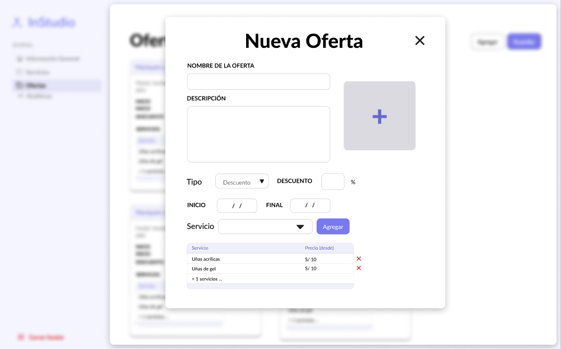

# 2.1. Requerimientos Funcionales

## Módulo 01 - Gestión de Reservas

| ID | Nombre | Historia de Usuario |
| --- | --- | --- |
| RF.1.1 | Selección del servicio deseado, fecha, y hora disponibles | Yo, como usuario cliente, quiero poder seleccionar el servicio deseado, fecha, y hora disponibles del spa del cual quiere obtener una cita|
| RF.1.2 | Confirmación de disponibilidad en tiempo real antes de completar la reserva | Yo, como usuario cliente, quiero que el sistema confirme la disponibilidad en tiempo real para asegurar que el horario y servicio seleccionado estén disponibles antes de completar la reserva. |
| RF.1.3 | Visualización de todas las reservas futuras y pasadas en un perfil personal | Yo, como usuario cliente, quiero ver todas mis reservas pasadas y futuras en mi perfil, para poder gestionar y hacer seguimiento a mis citas en el spa. |
| RF.1.4 |  Posibilidad de cancelar o modificar una reserva | Yo, como usuario cliente, quiero poder cancelar o modificar mis reservas dentro del límite permitido por el spa, para ajustar mis citas según mi disponibilidad. |
| RF.1.5 |  Visualización de todas las reservas realizadas por los usuarios  | Yo, como administrador del spa, quiero poder ver todas las reservas realizadas por los usuarios para gestionar las citas y tener control sobre la disponibilidad de los servicios. |
| RF.1.6 |  Posibilidad de rechazar una reserva si no hay disponibilidad (con opción de reprogramar)| Yo, como administrador del spa, quiero poder rechazar una reserva en caso de que no haya disponibilidad, con la opción de ofrecer una reprogramación para una fecha y hora alternativa. |
| RF.1.7 | Gestión de horarios  | Yo, como administrador del spa, quiero gestionar los horarios para ajustar la disponibilidad de reservas y asegurarme de que los servicios puedan prestarse. |

1.- Visualización del Spa Seleccinado y Sus Servicios

2.- Selección de Servicio

3.- Selección de Día y Hora

## Módulo 02 - Notificaciones

## Prototipo Alta Fidelidad

## Requerimientos

| ID    | Nombre  | Historia de Usuario | 
| ----- | --------| ------------------- |
| 2.1     | Notificaciones de Confirmación de Reserva | Como usuario tipo salón de belleza, quiero recibir notificaciones push y correos electrónicos cuando un cliente confirme una reserva, para estar informado de las próximas citas.       |
| 2.2     | Recordatorios de Citas                 | Como usuario cliente, quiero recibir recordatorios automáticos de mis próximas citas a través de notificaciones push y correos electrónicos, para asegurar mi asistencia.               |
| 2.3     | Comunicación de Ofertas Especiales      | Como usuario cliente, quiero recibir notificaciones sobre ofertas especiales y descuentos disponibles, para aprovechar promociones y obtener mejores precios en servicios.              |                
| 2.4     | Gestión de Preferencias de Notificación | Como usuario, quiero poder gestionar mis preferencias de notificación, eligiendo qué tipo de notificaciones recibir y por qué canal, para tener control sobre la información.         |

## Módulo 03 - Gestión de Ofertas

| ID | Nombre | Historia de Usuario |
| --- | --- | --- |
| RF.3.1 | Creación de ofertas | Yo, como administrador del salón de belleza, quiero poder crear nuevas ofertas promocionales con detalles como título, descripción, descuento, fechas de vigencia e imagen para atraer más clientes y aumentar las reservas. |
| RF.3.2 | Visualización de ofertas activas | Yo, como usuario cliente, quiero ver una lista de todas las ofertas activas en la página principal del salón de belleza, para aprovechar las promociones disponibles al hacer una reserva. |
| RF.3.3 | Edición de ofertas existentes | Yo, como administrador del salón de belleza, quiero poder editar las ofertas promocionales que ya he creado, para actualizar la información o modificar las condiciones si es necesario. |
| RF.3.4 | Eliminación de ofertas | Yo, como administrador del salón de belleza, quiero poder eliminar ofertas que ya no son válidas o necesarias, para mantener la lista de promociones actualizada y relevante. |
| RF.3.5 | Visualización de detalles de la oferta | Yo, como usuario cliente, quiero poder ver los detalles completos de una oferta, incluyendo el descuento aplicado, las condiciones, y la fecha de expiración, para tomar una decisión informada al reservar un servicio. |
| RF.3.6 | Activación y desactivación de ofertas | Yo, como administrador del salón de belleza, quiero poder activar o desactivar ofertas temporalmente sin eliminarlas, para gestionar la disponibilidad de promociones de manera flexible. |

1.- Gestión de Ofertas

2.- Creación de oferta tipo descuento

3.- Creación de oferta tipo combo

4.- Creación de oferta tipo bono

4.- Editar oferta

5.- Visualización de ofertas

6.- Reserva de un servicio con una oferta

## Módulo 04 - Seguridad

| ID | Nombre | Historia de Usuario |
| --- | --- | --- |
| RF.4.1 | Autenticación segura de usuarios | Yo, como usuario cliente, quiero autenticarme en la plataforma de manera segura usando mis credenciales para acceder a mis funcionalidades personalizadas según mi rol. |
| RF.4.2 | Formulario de ingreso de credenciales | Yo, como usuario cliente, quiero un formulario seguro para ingresar mi usuario y contraseña, de manera que mis datos estén protegidos durante el inicio de sesión. |
| RF.4.3 | Encriptación de la contraseña antes del envío | Yo, como usuario cliente, quiero que mi contraseña sea encriptada antes de enviarse, para garantizar que no sea accesible a terceros durante el proceso de autenticación. |
| RF.4.4 | Gestión segura de sesiones | Yo, como usuario cliente, quiero que el sistema gestione mi sesión de manera segura después de iniciar sesión, para proteger mi cuenta durante el uso de la plataforma. |
| RF.4.5 | Control de acceso basado en roles | Yo, como administrador, quiero que el sistema asigne permisos según el rol de cada usuario, para que accedan solo a las funcionalidades correspondientes. |
| RF.4.6 | Cierre de sesión seguro | Yo, como usuario cliente, quiero poder cerrar sesión de forma segura en cualquier momento para asegurar que mi cuenta no permanezca activa sin supervisión. |
| RF.4.7 | Restablecimiento seguro de contraseña | Yo, como usuario cliente, quiero un proceso seguro para restablecer mi contraseña en caso de olvido, garantizando que solo yo pueda recuperar el acceso a mi cuenta. |

## Módulo 05 - Gestión de Pagos

| ID | Nombre | Historia de Usuario |
| --- | --- | --- |
| RF.5.1 | Pagos en línea seguros | Yo, como usuario cliente, quiero realizar pagos en línea de manera segura, eficiente y confiable, para garantizar la protección de mi información sensible. |
| RF.5.2 | Formulario seguro para información de pago | Yo, como usuario cliente, quiero un formulario seguro para ingresar mi información de pago (número de tarjeta, fecha de vencimiento, CVV) de manera protegida. |
| RF.5.3 | Encriptación de la información de pago | Yo, como usuario cliente, quiero que toda mi información de pago sea encriptada antes de su envío y almacenamiento, para proteger mis datos de posibles accesos no autorizados. |
| RF.5.4 | Integración de pasarela de pago | Yo, como administrador, quiero integrar una pasarela de pago segura y reconocida que cumpla con los estándares PCI DSS, para asegurar que las transacciones financieras se manejen de forma segura. |

## Módulo 06 - Analíticas

### Prototipo Alta Fidelidad

### Requerimientos

| ID | Nombre | Historia de Usuario |
| --- | --- | --- |
| RF5.1 | Filtro de fecha | Como usuario autenticado, tipo salón de belleza, en la sección "Analíticas" quiero ver un componente que me permita seleccionar el periodo con el que se filtrará la información en este módulo, para el control de mi información |
| RF5.2 | Métricas | Como usuario autenticado, tipo salón de belleza, en la sección "Analíticas" quiero ver métricas que reflejen el número de reservas, cancelación de reservas e ingresos en base al componente filtro de fecha (RF5.1) , para tener un control de mi rendimiento en el aplicativo |
| RF5.3 | Descarga masiva | Como usuario autenticado,tipo salón de belleza, en la sección "Analíticas", quiero contar con la posibilidad de exportar las métricas generadas a frecuencia diaria en el periodo seleccionado en el componente filtro de fecha (RF5.1). Será exportado en un archivo tipo .csv, para tener un control de mi rendimiento en el aplicativo |
| RF5.4 | Gráficas de línea | Como usuario autenticado,tipo salón de belleza, en la sección "Analíticas", quiero visualizar en una gráfica de línea la progreso de las reservas e ingresos en el periodo seleccionado en el componente filtro de fecha (RF5.1), para tener un control de mi rendimiento en el aplicativo |
