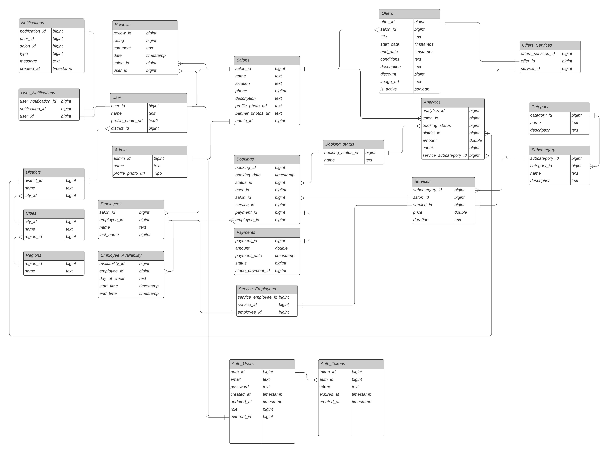

# 3.3. Modelo de Datos

## ADRs Para Gestión de Reservas

### Contexto

El módulo de Gestión de Reservas es una parte clave de nuestra aplicación web para la reserva de servicios en spas y salones de belleza. Permite a los usuarios visualizar los horarios disponibles y completar el proceso de reserva para los servicios deseados. Además, debe manejar de manera eficiente las solicitudes concurrentes y garantizar la consistencia en el procesamiento de reservas.

#### 1) Titulo: Elección entre Modelo Relacional vs Documental para el Módulo de Gestión de Reservas

El módulo de Gestión de Reservas maneja información sobre horarios y reservas en spas y salones de belleza. La estructura de los datos es relativamente simple, pero puede haber cambios frecuentes en los requisitos de los horarios y reservas. Es importante evaluar si un modelo de datos relacional o documental es más adecuado para este módulo.

#### Alternativas

#### 1.1 Modelo Relacional (PostgreSQL)

- **Ventajas**:
  - Garantiza consistencia y soporte para consultas estructuradas.
  - Maneja relaciones complejas entre entidades, como usuarios y reservas.
  - Ofrece soporte robusto para transacciones y operaciones ACID.

- **Desventajas**:
  - Menos flexible para esquemas cambiantes.
  - Puede ser más complejo de escalar horizontalmente en comparación con soluciones documentales.

#### 1.2 Modelo Documental (MongoDB)

- **Ventajas**:
  - Escalabilidad horizontal para manejar datos no estructurados y esquemas cambiantes.
  - Flexibilidad en la definición del esquema de datos, adaptándose fácilmente a cambios en los requisitos.
  - Ideal para manejar datos que cambian frecuentemente, como horarios de reservas.

- **Desventajas**:
  - Menor consistencia en comparación con bases de datos relacionales.
  - Puede requerir más esfuerzo para implementar transacciones complejas y garantizar integridad de datos.

#### Criterios de Elección

- Flexibilidad en la definición del esquema de datos.
- Requisitos de escalabilidad para manejar grandes volúmenes de datos y consultas.
- Consistencia y soporte para operaciones transaccionales.

#### Decisión

Se elige un modelo documental (MongoDB).

#### Sustento

El modelo documental es más adecuado para manejar los datos del módulo de Gestión de Reservas debido a su flexibilidad para adaptarse a cambios en los horarios y reservas. MongoDB permite que el esquema evolucione si existen requisitos cambiantes, lo que proporciona la escalabilidad necesaria para manejar grandes volúmenes de datos. Aunque un modelo relacional brinda mayor consistencia, la capacidad de escalar horizontalmente y la flexibilidad con MongoDB son más adecuadas para este módulo de reservas.

## ADRs Para Módulo de Autenticación

### Contexto

El módulo de Autenticación es fundamental para garantizar la seguridad y el acceso adecuado a la aplicación. Debe manejar información crítica sobre usuarios, credenciales y sesiones, asegurando que solo los usuarios autorizados puedan acceder a los servicios. Además, debe mantener la consistencia y la integridad de los datos en un entorno de acceso concurrente.

#### 1) Título: Elección entre Modelo Relacional vs Documental para el Módulo de Autenticación

El módulo de Autenticación gestiona información sobre usuarios y sus credenciales. Dada la naturaleza sensible de estos datos, es crucial evaluar si un modelo de datos relacional o documental es más adecuado para este módulo.

#### Alternativas

##### 1.1 Modelo Relacional (PostgreSQL)

- **Ventajas**:
  - Garantiza alta consistencia y soporte robusto para consultas estructuradas.
  - Maneja relaciones complejas, como la conexión entre usuarios y sus roles/privilegios.
  - Ofrece soporte robusto para transacciones y operaciones ACID, lo que es esencial para la gestión de credenciales.

- **Desventajas**:
  - Menos flexible para esquemas cambiantes.
  - Puede ser más complejo de escalar horizontalmente en comparación con soluciones documentales.

##### 1.2 Modelo Documental (MongoDB)

- **Ventajas**:
  - Escalabilidad horizontal para manejar datos no estructurados y esquemas cambiantes.
  - Flexibilidad en la definición del esquema de datos, adaptándose fácilmente a cambios en los requisitos.
  
- **Desventajas**:
  - Menor consistencia en comparación con bases de datos relacionales.
  - Puede requerir más esfuerzo para implementar transacciones complejas y garantizar la integridad de datos, especialmente críticos en un módulo de autenticación.

#### Criterios de Elección

- Necesidad de alta consistencia y soporte para operaciones transaccionales.
- Capacidad para manejar relaciones complejas entre usuarios y roles.
- Requisitos de seguridad y gestión de credenciales.

#### Decisión

Se elige un modelo relacional (PostgreSQL).

#### Sustento

El modelo relacional es más adecuado para manejar los datos del módulo de Autenticación debido a su capacidad para garantizar alta consistencia y soporte para transacciones críticas. PostgreSQL proporciona un marco robusto para gestionar la integridad de las credenciales y las relaciones complejas entre usuarios y sus privilegios. Aunque un modelo documental ofrece flexibilidad, la seguridad y la integridad de los datos son primordiales en la autenticación, lo que hace que el modelo relacional sea la mejor opción para este módulo.

## ADR para Notificaciones

### Titulo: Elección entre almacenamiento SQL o NoSQL

Se busca una rápida escritura y lectura de los datos para el envío masivo de notificaciones.

### Alternativas

### 2.1 NoSQL Clave-Valor:

- **Ventajas**:
   - Escabilidad: Permite una escalabilidad horizontal (aumentar más servidores)
   - Facilidad de acceso: El acceso a la información es simple
   - Rendimiento: Consumen poco por no haber interrelaciones
   - Alta Disponibilidad: Ofrecen replicación de la información

- **Desventajas**:
   - Consultas simples: No acepta consultas complejas
   - Se compromete la coherencia
   - Al perderse la coherencia de los datos, puede añadir la complejidad en las interacciones
### 2.2. SQL

- **Ventajas**:
   - Escabilidad: Permite una escalabilidad vertical (aumentar potencia)
   - Rendimiento: Excelente para aplicaciones donde se requiere la consistencia de datos, integridad transaccional (ACID), y consultas complejas
   - Facilidad: Usa un lenguaje de consulta que facilita el manejo de los datos
   - Integración con herramientas: Existen herramientas que facilita su interacción y su uso
- **Desventajas**:
  - Escabilidad Limitada: Tiene un limite de crecimiento, por el costo y potencia
  - Mayor sobrecarga en consultas complejas por mantener la coherencia
  - Mayor complejidad en la configuración y mantenimiento 

### Criterios de Elección

- Velocidad de acceso
- Volumen de datos y escabilidad
- Flexibilidad para los distintos tipos de notificaciones (ofertas, recordatorios)
- Contenido de consulta de fácil acceso

### Decisión

Se elige NoSQL Clave Valor

### Sustento

Debido a que se las operaciones que se realizaran serán sencillas, se necesita un rápido acceso, así como una flexbilidad para la estructura de los notificaciones, se eligió NoSQL Clave Valor.

## ADR para Gestión de Ofertas

### 1) Título: Elección entre Almacenamiento Relacional vs NoSQL para el Módulo de Gestión de Ofertas

### Contexto
El módulo de ofertas de InStudio permite a los salones de belleza crear y gestionar promociones dinámicas, como llevar uno gratis (ej. 2x1), descuentos por porcentaje, por monto de dinero, etc. Dado que el tipo de oferta y los detalles de cada una pueden variar, se está evaluando la mejor opción de base de datos para almacenar estas ofertas. Lo que se necesita es solución flexible, que permita un fácil ajuste a nuevas promociones y campos, con rendimiento adecuado para consultas dinámicas y rápidas modificaciones. Para ello se va a comparar un modelo SQL y uno NoSQL para determinar cuál es la mejor opción para este módulo.

### Alternativas

#### 1.1 Modelo SQL

- **Ventajas**:
  - Al ser un modelo relacional garantiza la consistencia de los datos.
  - Las bases de datos relacionales ofrecen transacciones ACID, lo que garantiza la consistencia de los datos y protege contra problemas de concurrencia y fallos en el sistema.
  - Estos modelos ofrecen capacidades avanzadas para realizar consultas complejas con JOINs, agregaciones y funciones de ventana, que permiten análisis detallados de las ofertas sin necesidad de mover los datos a otro sistema.

- **Desventajas**:
  - Manejar diferentes tipos de ofertas puede llevar a modelos de datos complejos si cada tipo tiene un conjunto diferente de detalles y se tendrían que realizar consultas más sofisticadas para gestionar esta variabilidad.
  - Aunque los sistemas relacionales pueden escalar verticalmente, escalar horizontalmente es más complicado y generalmente menos eficiente que en sistemas NoSQL.
  - Si los tipos de ofertas cambian o requieren nuevos campos, será necesario modificar el esquema de las tablas, lo que puede requerir migraciones costosas

#### 1.2 Modelo NoSQL

- **Ventajas**:
  - Permite almacenar documentos con diferentes estructuras dentro de la misma colección.
  - Se escala fácilmente de manera horizontal, lo que permite gestionar grandes volúmenes de datos de manera más eficiente en aplicaciones distribuidas.
  - Almacena los datos en un formato BSON (una forma binaria de JSON), lo que facilita la integración con aplicaciones web que usualmente ya manejan datos en formato JSON.

- **Desventajas**:
  - Aunque algunos sistemas NoSQL soportan transacciones, estas no son tan robustas como las de las bases de datos SQL.
  - La flexibilidad del esquema puede volverse un problema si no se manejan correctamente las validaciones de los datos a nivel de aplicación

### Criterios de Elección

- Flexibilidad
- Escalabilidad
- Mantenibilidad

### Decisión

Se elige un modelo NoSQL como la base de datos para el módulo de ofertas.

### Sustento

Se elige a un modelo NoSQL debido a su flexibilidad para manejar estructuras de datos variables, como las diferentes configuraciones de ofertas (descuentos, combos, etc.), sin la necesidad de realizar migraciones de esquema, lo que garantiza una mayor mantenibilidad a largo plazo. Además, un modelo NoSQL permite una escalabilidad horizontal más eficiente, lo cual es ideal para manejar un crecimiento en el volumen de datos. Al ser una base de datos orientada a documentos, también proporciona un rendimiento adecuado para lecturas y escrituras rápidas, esenciales para un sistema que debe acceder y mostrar ofertas de forma dinámica y en tiempo real.

