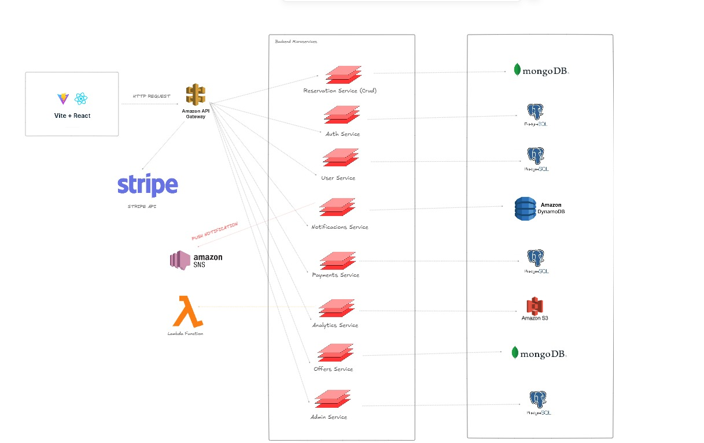

# 3.4. Mapeo entre elementos de Arquitectura

## Descripción de la Arquitectura

### 1. Frontend 
- **Vite + React:** Es la interfaz de usuario, desarrollada usando Vite (una herramienta de desarrollo rápida para proyectos web) y React (una librería de JavaScript para construir interfaces de usuario). 
  - La interfaz envía solicitudes HTTP a la API del backend.
  - También interactúa con **Stripe API** para procesar pagos.

### 2. Amazon API Gateway 
- Se encarga de recibir las solicitudes HTTP desde el frontend y enviarlas a los microservicios del backend.
- **Amazon SNS:** Vinculado al sistema de notificaciones, se envían notificaciones push a través de Amazon SNS, utilizando **Lambda Functions** para gestionar el flujo de datos.

### 3. Backend Microservices 
- **Reservation Service (CRUD):** Gestiona reservas con operaciones CRUD (Create, Read, Update, Delete).
- **Auth Service:** Servicio de autenticación.
- **User Service:** Gestiona los usuarios.
- **Notifications Service:** Maneja notificaciones.
- **Payments Service:** Procesa pagos.
- **Analytics Service:** Realiza análisis de datos.
- **Offers Service:** Gestiona las ofertas.
- **Admin Service:** Servicio para la administración.

Estos microservicios están interconectados y se vinculan con las bases de datos correspondientes.

### 4. Bases de Datos 
- **MongoDB:** Base de datos NoSQL utilizada por algunos servicios como el de ofertas (Offers Service).
- **PostgreSQL:** Base de datos relacional usada por varios servicios.
- **Amazon DynamoDB:** Base de datos NoSQL, probablemente usada para datos de alta velocidad o escalabilidad.

### Interacciones clave
- **Amazon SNS:** Facilita las notificaciones push a través de servicios de backend.
- **Lambda Functions:** Procesan ciertos eventos o flujos de datos automatizados.
- **Stripe API:** Se utiliza para integrar los pagos con los servicios de backend.

## Diagrama Cloud

## Backend
En el backend de InStudio, se planea seguir el enfoque de **Domain-Driven Design (DDD)**, ya que este modelo utiliza varios conceptos y patrones que permiten organizar el código de manera que refleje fielmente el dominio del problema que se está abordando. Aunque DDD no establece una estructura de paquetes rígida, existen algunos paquetes y capas comunes que suelen emplearse tanto en aplicaciones basadas en microservicios como en monolitos. En el caso de nStudio, estos paquetes se estructurarían de la siguiente manera:

- **domain**: Este paquete encapsula las clases y estructuras que representan el núcleo del negocio. Aquí es donde se encuentran las entidades, agregados, y objetos de valor, formando el corazón de la lógica de dominio de la aplicación.

- **application**: La lógica de aplicación se coloca aquí, actuando como un puente entre la capa de dominio y otras capas como la presentación o la infraestructura. Es donde se implementan casos de uso específicos y los servicios que gestionan la lógica de la aplicación.

- **infrastructure**: Este paquete agrupa las clases relacionadas con aspectos técnicos, como la implementación de repositorios, servicios de notificaciones, adaptadores de bases de datos y otros componentes de soporte que permiten que la aplicación funcione correctamente desde el punto de vista técnico.

- **presentation**: En este paquete reside la lógica que maneja la interfaz de usuario o cualquier otra presentación de la aplicación, incluyendo controladores, vistas, y componentes de la interfaz.

- **persistence**: A menudo se crea un paquete dedicado para gestionar la persistencia de datos. Aquí se definen las implementaciones relacionadas con el acceso y almacenamiento de datos, como los repositorios o adaptadores específicos de bases de datos.

- **services**: Aquí se agrupan servicios reutilizables que no encajan completamente en los demás paquetes. Estos servicios pueden proveer funcionalidades compartidas o utilidades para varias partes de la aplicación.

Esta estructura asegura que el código se organice de manera que siga los principios de DDD, permitiendo que cada paquete cumpla con una función específica en el sistema de InStudio.

## Frontend
En el frontend de **InStudio**, se ha decidido seguir el enfoque de **"Clean Architecture"** o **"Arquitectura Limpia"**, similar al enfoque de **Domain-Driven Design (DDD)** utilizado en el backend. Esta estrategia ayuda a mantener una separación clara de responsabilidades y promueve la consistencia en todo el sistema. Los principios clave de esta arquitectura son:

- **Capas de dependencia decreciente**: La aplicación se divide en capas concéntricas, con dependencias que disminuyen a medida que se avanza hacia el núcleo. Esto significa que las capas internas no dependen de las capas externas. Las capas principales son:
  - **Dominio**: Contiene las entidades, objetos de valor y las reglas de negocio. Es el núcleo del sistema.
  - **Aplicación**: Aloja casos de uso, servicios de aplicación y lógica que orquesta las operaciones en el dominio.
  - **Infraestructura**: Maneja aspectos técnicos, como la interacción con bases de datos, servicios externos y la UI.

- **Independencia de frameworks**: La lógica del negocio está desacoplada de cualquier framework específico. Esto permite que los componentes tecnológicos sean reemplazados sin afectar el núcleo de la aplicación.

- **Inversión de dependencias (Dependency Inversion Principle - DIP)**: Las dependencias se invierten de manera que las capas internas no dependan de las externas. Esto se logra mediante la inyección de dependencias.

- **Interacción a través de interfaces**: Las capas se comunican a través de interfaces o contratos claramente definidos. Por ejemplo, se utilizan interfaces de servicio para conectar la capa de aplicación con la de dominio.

- **Tests unitarios y pruebas automatizadas**: Se fomenta el uso de pruebas unitarias para asegurar que las capas funcionen de manera independiente y correcta.

- **Flexibilidad y escalabilidad**: Esta arquitectura permite que la aplicación evolucione y se escale sin impactar el núcleo de la lógica de negocio, lo que facilita la adaptación a nuevos requisitos.

Esta estructura le proporciona a **InStudio** una base sólida para el crecimiento y la adaptación a futuro, manteniendo la lógica del negocio separada de los detalles técnicos.

