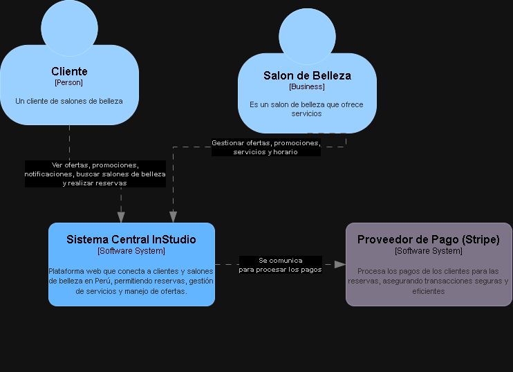

# 5.1. Contexto

**Descripción:** Plataforma web que conecta a clientes y salones de belleza en Perú, permitiendo reservas, gestión de servicios y manejo de ofertas.

### Usuarios y Sistemas Externos:

- **Clientes (Usuarios)**
  - **Interacción:** Utilizan la plataforma para buscar salones, ver servicios, precios y realizar reservas en línea.

- **Salones de Belleza (Proveedores)**
  - **Interacción:** Gestionan horarios, disponibilidad, personal, ofertas, y reservas a través de la plataforma.

- **Proveedor de Pago (Stripe)**
  - **Interacción:** Procesa los pagos de los clientes para las reservas, asegurando transacciones seguras y eficientes.

### Imagen: 

