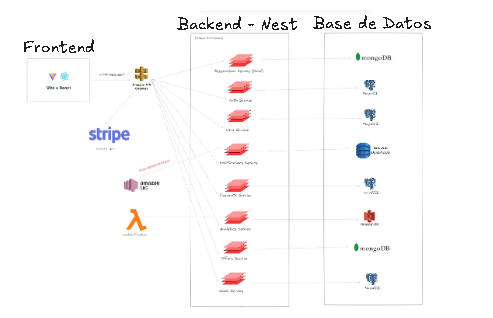

# 6.2. Mapeo Aplicaciones vs Componentes

Como se observa en la imagen, existe una coherencia con las aplicaciones descritas en la sección 6.1 y los diagramas previamente realizados. 

A continuación se muestra el mapeo entre componentes y aplicaciones en el front-end y en el backend

## Backend
En el backend se utiliza un monorepo de Nx  en Nest.js, aqui ya se puede apreciar cada microservicio a realizarse creado

Asimismo, se tenemo unas librerias para el manejo de base de datos de los modulos con BD relacional y una libreria que implementa para mongoose en un repositorio abstracto que podra ser usado por los microservicios

Como ejemplo de estructura de los microservicios se muestra el servicio de booking/reservaciones:

Podemos observar que se basa en la **arquitectura modular** que utiliza principios de **arquitectura en capas** , especialmente dentro de Nest.js. 

### Arquitectura Modular

La arquitectura está organizada en módulos, donde cada módulo representa una funcionalidad o un conjunto de funcionalidades específicas. Esto es evidente en carpetas como:

- cancel-booking: Parece que maneja las cancelaciones de reservas.
- completed-booking: Maneja las reservas completadas.
- pending-booking: Se ocupa de las reservas pendientes.
  
Cada una de estas funcionalidades está organizada de manera independiente. Esto significa que si necesitas trabajar o hacer cambios en cómo funciona la lógica de las reservas pendientes, solo tienes que modificar el módulo correspondiente sin afectar el resto de la aplicación.

Beneficios del enfoque modular:

- Reutilización de código: Los módulos pueden ser importados y reutilizados en otras partes de la aplicación.
- Separación de responsabilidades: Cada módulo tiene su propio conjunto de responsabilidades.
- Escalabilidad: Puedes agregar nuevos módulos sin necesidad de alterar drásticamente el código existente.

### Arquitectura en Capas
La estructura también sigue principios de arquitectura en capas, donde cada capa tiene un propósito específico y la interacción entre ellas está bien definida:

**a) Controladores:**

Por ejemplo, el archivo pending.controller.ts dentro de pending-booking se encarga de manejar las solicitudes HTTP que llegan desde los usuarios.
El controlador solo recibe las peticiones y delega la lógica de negocio a los servicios.

**b) Servicios:**

El archivo pending.service.ts dentro de pending-booking contiene la lógica de negocio, es decir, cómo se manejan las reservas pendientes.
Aquí se ejecutan las operaciones principales como validaciones, cálculos o interacciones con la base de datos.

**c) Repositorio/Acceso a Datos:**

Aunque en este caso está representado por un "servicio" o el archivo pending.repository.ts, esta parte es la que se encarga de comunicarse con la base de datos, en este caso usando MongoDB a través de Mongoose, y de realizar consultas, inserciones, actualizaciones, etc.

**d) DTO (Data Transfer Objects):**

Los archivos en dto como create-booking-dto.ts definen cómo deben estructurarse los datos que entran a la aplicación (validación de datos). Por ejemplo, al crear una reserva, el DTO valida que los datos tengan la forma y tipos correctos antes de que pasen a la lógica de negocio.

**e) Esquemas:**
En schemas/booking.schema.ts, probablemente defines los modelos de datos para MongoDB, indicando cómo se almacenarán las reservas en la base de datos.

## Front-End

La arquitectura sigue el patron Single Page Application (SPA) basada en React. Las características clave incluyen:

- **Componentes reutilizables:** Elementos como Footer, Header, y CardOffer pueden ser usados en diferentes vistas.
- **Modularización:** La aplicación está dividida en módulos que representan vistas (páginas) y se apoyan en componentes reutilizables.
- **Layouts:** Definición de diferentes estructuras de página para usuarios autenticados y no autenticados.
- **Rutas Protegidas:** Indica la existencia de navegación protegida para gestionar el acceso según el estado del usuario.

## Base de Datos

Para el desarrollo de la aplicacion se corre un docker-compose.yaml que contiene nuestras bases de datos a utilizar

