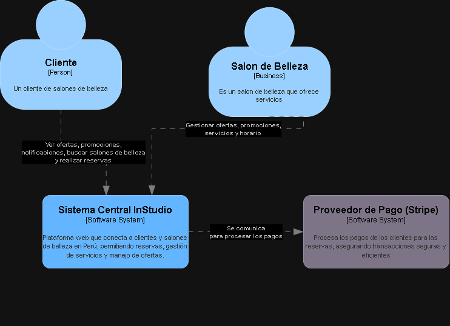
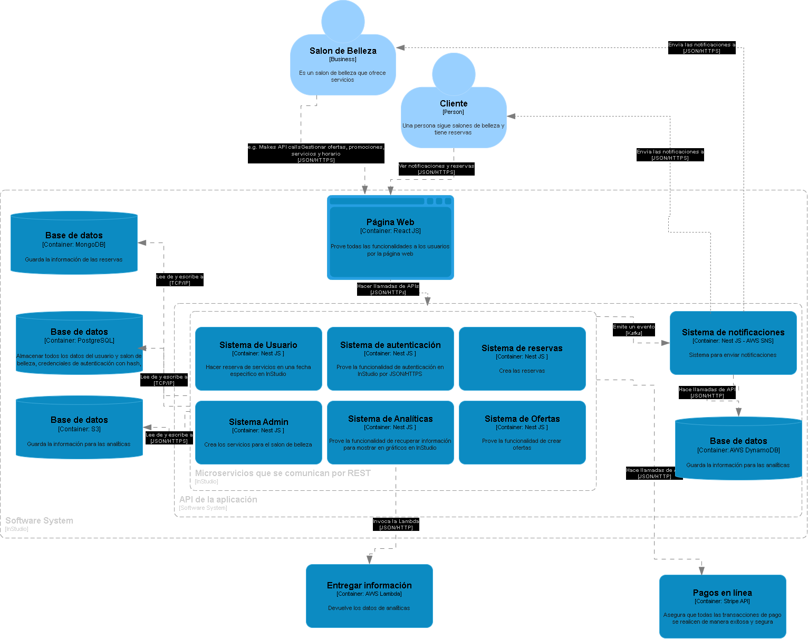
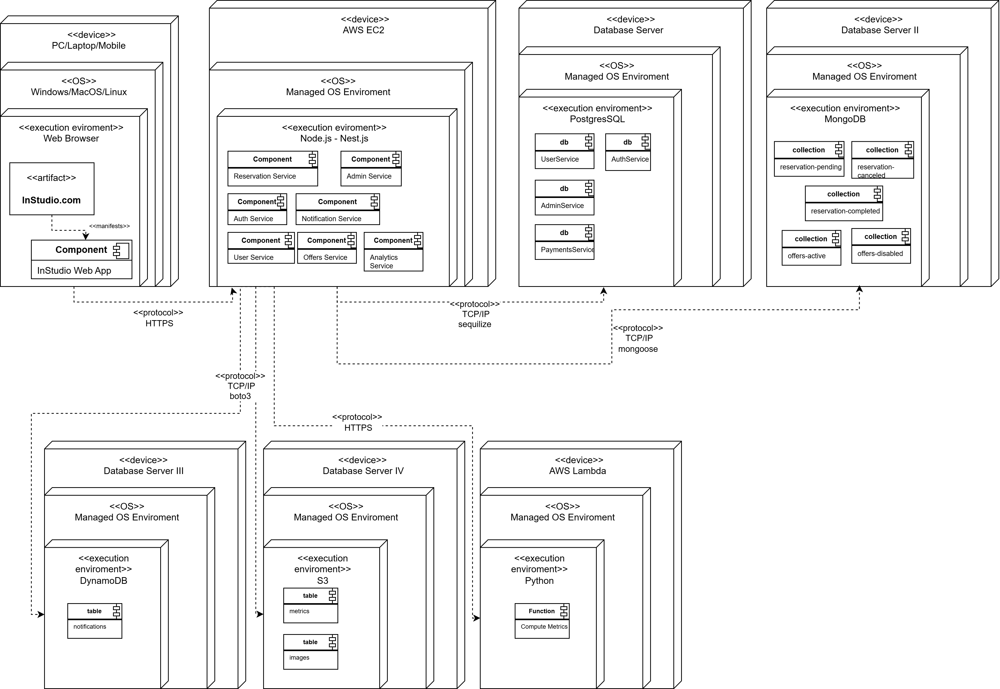

# 9.2. Iteración 1: Definir la estructura general del sistema

## 2. Objetivo de la iteración
El objetivo de la primera iteración es la definición de la estructura y funcionamiento inicial de la plataforma InStudio.

## 3. Elementos del sistema a refinar

### **Diagrama de contexto**

En el diagrama de contexto se puede apreciar la interacción entre los usuarios, como los clientes y salones de belleza, con el sistema central InStudio y este a su vez con el proveedor de pago.

## 4. Conceptos de diseño que satisfacen el driver seleccionado
| Código | Decisión de diseño | Fundamentación
| --- | --- | --- |
| DEC-1 | Desarrollar la interfaz de usuario utilizando React con Vite | React ofrece una lógica de desarrollo clara, además que hay una basta cantidad de documentación que facilita la mantenibilidad del sistema y Vite optimiza el funcionamiento del sistema (QA13) y permite la creación de diseños responsive (CON02). Además, el equipo posee conocimientos sólidos sobre el uso e implementación de esta librería (CRN02).
| DEC-2 | El backend utilizará el patrón DDD | Para asegurar la escalabilidad y mantenibilidad del sistema, se utilizará el patrón de módulo, Descomposición por Dominio. (QA06, QA13) 
| DEC-3 | Se utilizará NestJs para el backend | Debido a que se desarrollarán varios módulos independientes (DEC-2), NestJS es una buena opción porque ofrece un enfoque de microservicios Además, el equipo posee conocimientos sólidos sobre el uso de este framework (CRN02).

## 5. Instanciar elementos de arquitectura, asignar responsabilidades y definir interfaces
| Código | Decisión de diseño | Fundamentación
| --- | --- | --- |
| DEC-4 | Definición de módulos | Para asegurar la escalabilidad y mantenibilidad, se determinan los módulos de reservas, ofertas, analíticas, notificaciones, seguridad, pagos, usuarios, administrador y autenticación para trabajar en ellos de manera independiente, minimizar las interrupciones totales y aumentar la escalabilidad personal dependiendo de la demanda, satisfaciendo los escenarios de calidad QA06 y QA13.  |
| DEC-5 | Uso de Amazon S3 para analíticas | Se usará Amazon S3 donde se almacenarán archivos parquet para aumentar el rendimiento permitiendo escaneos más rápidos y menores costos de consulta satisfaciendo CU06, CRN06 y QA09.| 
| DEC-6 | PostgreSQL para servicios de Auth, User, Admin y Payments | PostgreSQL es una base de datos relacional que permite acceder rápidamente a datos estructurados, ideal para servicios que requieren transacciones rápidas y consistencia (CRN06, QA09).
| DEC-7 | MongoDB para servicios de Ofertas y Reservas | MongoDB al ser una base de datos documental, permite manejar datos no estructurados o con cambios frecuentes de esquema, facilitando la flexibilidad y adaptabilidad a requisitos cambiantes (QA06, CRN06).
| DEC-8 | DynamoDB para notificaciones de usuario | DynamoDB, ofrece acceso rápido y eficiente, su facilidad para integrarse con SNS para enviar notificaciones es ideal para el manejo tiempo real, garantizando rendimiento en alta concurrencia (CRN06, QA13).
| DEC-9 | Pasarela de pago | El sistema se integrará con la pasarela de pago Stripe (CRN04, QA03).

## 6. Bosquejar vistas y registrar decisiones de diseño
### Vista inicial de módulos

### Vista inicial de despliegue

## 7. Analizar el diseño actual, revisar objetivo de la iteración y logro del propósito del diseño

| No abordado | Parcialmente Abordado | Completamente abordado | Decision de diseño     |
| -- | -- | -- | -- |
| | | CU-01 | DEC-4, DEC-7 |
| | | CU-02 | DEC-4, DEC-7 |
| | | CU-03 | DEC-4, DEC-7 |
| | | CU-04 | DEC-4, DEC-8 |
| | CU-05 | | DEC-4, DEC-7 |
| | CU-06 | | DEC-4, DEC-5 |
| | | CU-07 | DEC-4, DEC-6, DEC-9 |
| | QA-01 | | DEC-4, DEC-7 |
| | QA-02 | | DEC-4, DEC-5, DEC-6 |
| | | QA-03 | DEC-4, DEC-6, DEC-9 |
| | | QA-04 | DEC-4, DEC-8 |
| | QA-05 | | DEC-4, DEC-5, DEC-6 |
| | QA-06 | | DEC-4, DEC-7 |
| | | QA-07 | DEC-4, DEC-7, DEC-9 |
| | QA-08 | | DEC-4, DEC-6 |
| | QA-09 | | DEC-4, DEC-6 |
| | QA-10 | | DEC-4, DEC-6 |
| | | QA-11 | DEC-4, DEC-6 |
| | QA-12 | | DEC-4, DEC-8 |
| | | QA-13 | DEC-1, DEC-2, DEC-3, DEC-4 |
| | | CON-01 | DEC-4, DEC-6, DEC-9 |
| | | CON-02 | DEC-1 |
| | | CON-03 | DEC-1 |
| | | CON-04 | DEC-4, DEC-6, DEC-9 |
| | | CON-05 | DEC-4, DEC-6, DEC-9 |
| | | CON-06 | DEC-4, DEC-6, DEC-9 |
| | | CON-07 | DEC-4, DEC-6, DEC-9 |